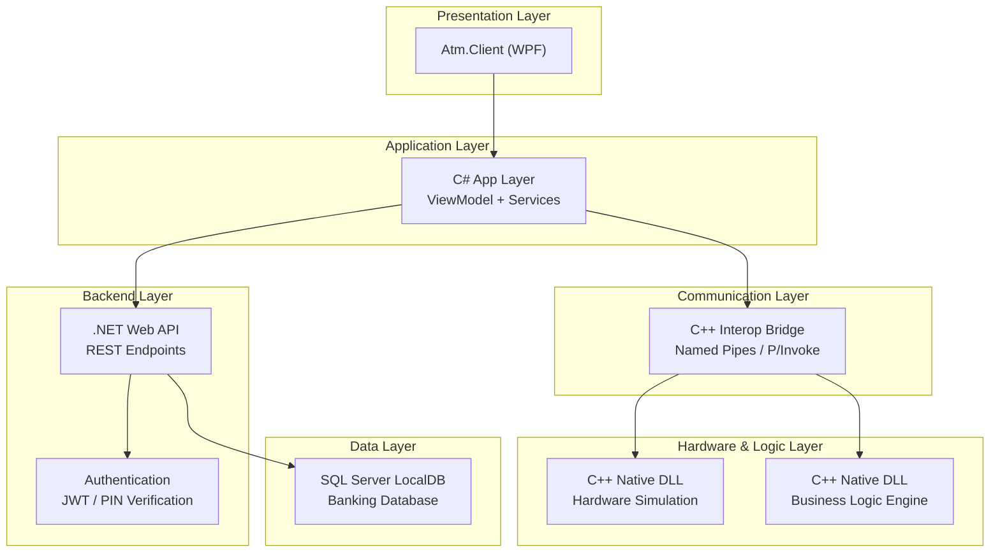
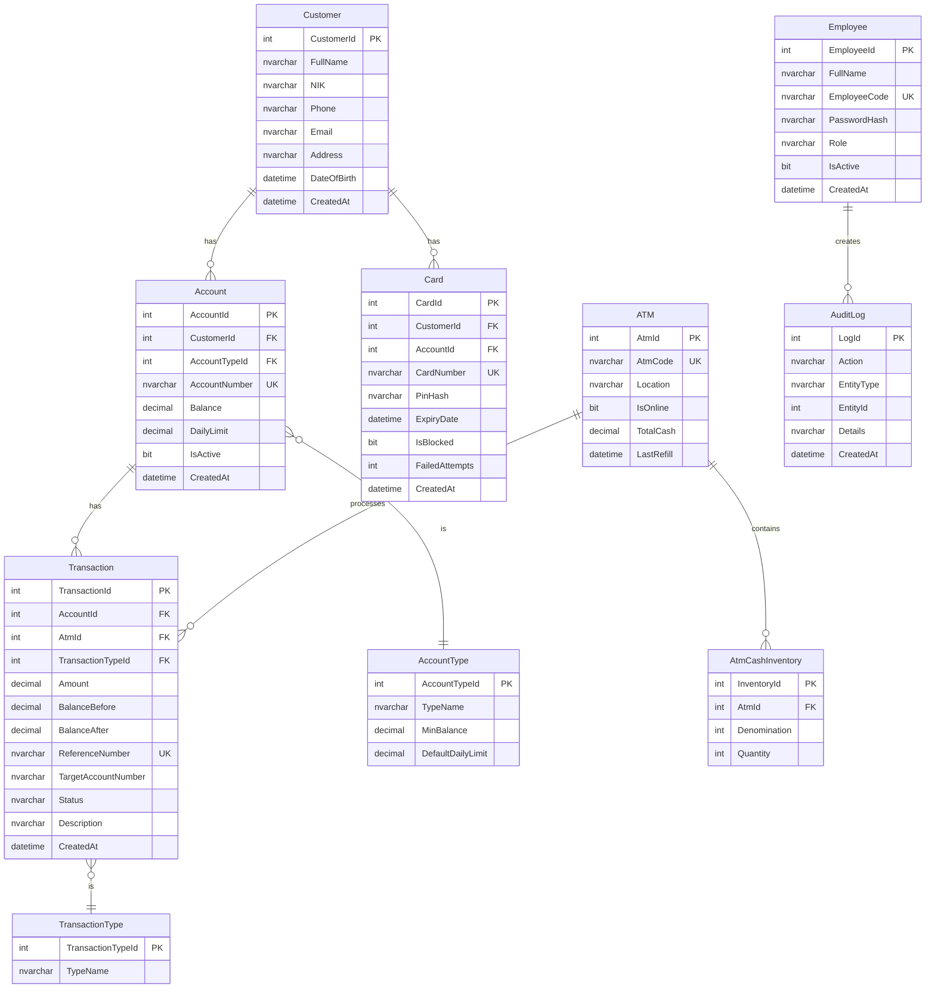
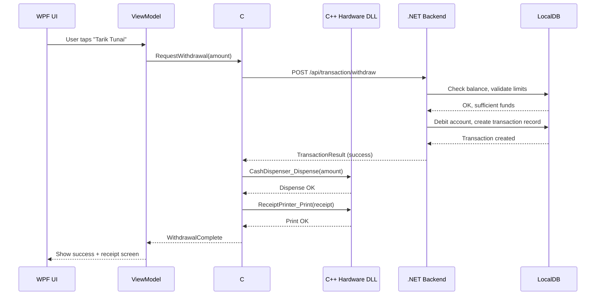

# 🏦 Banking Ecosystem Simulation — Architecture Plan

Simulasi ekosistem perbankan lengkap dengan ATM, termasuk card reader, cash dispenser, receipt printer, dan core banking backend.

---

## 1. System Architecture Overview



---

## 2. Layer Breakdown

### 2.1 — WPF UI Layer (Presentation)

Tampilan visual ATM yang realistis. Menggunakan **MVVM pattern**.

| Screen                 | Deskripsi                                         |
| ---------------------- | ------------------------------------------------- |
| `IdleScreen`           | Tampilan awal "Masukkan Kartu"                    |
| `PinEntryScreen`       | Keypad untuk input PIN (masked)                   |
| `MainMenuScreen`       | Menu utama: Tarik Tunai, Cek Saldo, Transfer, dll |
| `WithdrawalScreen`     | Pilih nominal / custom amount                     |
| `BalanceInquiryScreen` | Tampilkan saldo + mini statement                  |
| `TransferScreen`       | Input rekening tujuan + nominal                   |
| `ReceiptScreen`        | Struk digital / print preview                     |

**Tech:**

- WPF + XAML (custom controls, animations)
- MVVM via `CommunityToolkit.Mvvm`
- Page-based navigation (Frame/NavigationService)

> [!NOTE]
> Admin panel **bukan** bagian dari ATM app. Admin panel adalah **aplikasi desktop terpisah** yang merepresentasikan sistem perkantoran bank (lihat Section 2.7).

---

### 2.2 — C# Application Layer

Jembatan antara UI dan system layer. Berisi **ViewModels** dan **Service classes**.

```
Services/
├── AtmSessionService.cs       // Manage session state
├── CardService.cs             // Handle card insert/eject
├── PinService.cs              // PIN validation flow
├── TransactionService.cs      // Withdrawal, transfer, etc.
├── BalanceService.cs          // Balance inquiry
├── ReceiptService.cs          // Generate receipt
└── HardwareInteropService.cs  // Bridge ke C++ DLL
```

**Responsibilities:**

- State management (session, auth status)
- Business flow orchestration
- Memanggil C++ DLL via P/Invoke atau COM Interop
- Memanggil .NET Backend API via HttpClient

---

### 2.3 — C++ Hardware Simulation Layer

Simulasi device fisik ATM. Dikompilasi sebagai **Native DLL** dan dipanggil dari C# via **P/Invoke**.

| Module           | Simulasi                             |
| ---------------- | ------------------------------------ |
| `CardReader`     | Insert/eject/read card number        |
| `CashDispenser`  | Dispense cash, check remaining bills |
| `ReceiptPrinter` | Print receipt (output to file/log)   |
| `Keypad`         | PIN input simulation                 |
| `CashAcceptor`   | Accept cash deposit (future)         |

**Contoh API Header (`atm_hardware.h`):**

```cpp
extern "C" {
    __declspec(dllexport) int  CardReader_Insert(const char* cardNumber);
    __declspec(dllexport) int  CardReader_Eject();
    __declspec(dllexport) int  CashDispenser_Dispense(int amount);
    __declspec(dllexport) int  CashDispenser_GetRemainingBills();
    __declspec(dllexport) int  ReceiptPrinter_Print(const char* receiptData);
    __declspec(dllexport) int  Keypad_ReadPin(char* buffer, int maxLen);
}
```

---

### 2.4 — C++ Logic / Communication Layer

Core banking logic yang berjalan di sisi native untuk performa. Juga menangani protocol komunikasi.

**Logic modules:**

- Transaction validation (limit check, sufficient balance)
- Encryption helpers (PIN hashing, data encryption)
- ATM state machine (FSM: Idle → CardInserted → Authenticated → Transaction → Completed)

**Communication:**

- Opsi utama: **P/Invoke** (C# memanggil C++ DLL langsung)
- Opsi alternatif: **Named Pipes** (jika C++ berjalan sebagai proses terpisah)
- Opsi lanjutan: **gRPC** (jika nantinya ingin distributed)

> [!IMPORTANT]
> **Rekomendasi:** Gunakan **P/Invoke** untuk fase awal karena paling simpel. Jika nanti butuh C++ sebagai service terpisah, migrate ke Named Pipes atau gRPC.

---

### 2.5 — .NET Backend (Web API)

Core banking server yang mengelola data nasabah dan transaksi.

```
Controllers/
├── AuthController.cs          // Login, PIN verify, JWT token
├── AccountController.cs       // Get account info, balance
├── TransactionController.cs   // Withdrawal, deposit, transfer
├── CardController.cs          // Card validation, block/unblock
├── AdminController.cs         // ATM management, reporting
└── EmployeeController.cs      // Bank employee auth & operations

Services/
├── AuthService.cs
├── AccountService.cs
├── TransactionService.cs
├── CardService.cs
├── AdminService.cs
└── AuditLogService.cs
```

**Features:**

- RESTful API dengan ASP.NET Core Web API
- Authentication: JWT + PIN-based
- Rate limiting & fraud detection basic
- Audit logging untuk setiap transaksi

---

### 2.6 — Database (SQL Server LocalDB)



**TransactionType values:** `Withdrawal`, `Deposit`, `Transfer`, `BalanceInquiry`
**AccountType values:** `Savings`, `Checking`, `Business`

---

## 3. Project / Solution Structure

```
BankingEcosystem/
│
├── BankingEcosystem.sln                    # Main solution
│
├── src/
│   ├── BankingEcosystem.Atm.Client/        # WPF Project — ATM Client (Renamed from UI)
│   │   ├── Views/                          # XAML screens
│   │   ├── ViewModels/                     # MVVM ViewModels
│   │   ├── Controls/                       # Custom WPF controls (keypad, etc)
│   │   ├── Resources/                      # Styles, themes, assets
│   │   ├── Navigation/                     # Navigation service
│   │   └── App.xaml
│   │
│   ├── BankingEcosystem.Admin.UI/          # WPF Project — Bank Office System (TERPISAH)
│   │   ├── Views/                          # Dashboard, customer mgmt, ATM mgmt
│   │   ├── ViewModels/
│   │   ├── Resources/
│   │   └── App.xaml
│   │
│   ├── BankingEcosystem.Atm.AppLayer/      # C# Class Library
│   │   ├── Services/                       # Business orchestration
│   │   ├── Models/                         # DTOs, domain models
│   │   └── Interfaces/                     # Service contracts
│   │
│   ├── BankingEcosystem.Hardware/          # C++ DLL Project (.vcxproj)
│   │   ├── include/                        # Header files
│   │   ├── src/                            # Implementation
│   │   └── BankingEcosystem.Hardware.vcxproj
│   │
│   ├── BankingEcosystem.NativeLogic/       # C++ DLL Project (.vcxproj)
│   │   ├── include/                        # FSM, encryption, validation
│   │   ├── src/
│   │   └── BankingEcosystem.NativeLogic.vcxproj
│   │
│   ├── BankingEcosystem.Interop/           # C# Library — P/Invoke wrappers
│   │   └── NativeMethods.cs               # DllImport declarations
│   │
│   ├── BankingEcosystem.Backend/           # ASP.NET Core Web API
│   │   ├── Controllers/
│   │   ├── Services/
│   │   ├── Data/                           # EF Core DbContext, migrations
│   │   ├── Models/                         # Entities
│   │   └── Program.cs
│   │
│   └── BankingEcosystem.Shared/            # Shared C# Library
│       ├── DTOs/                           # Request/Response DTOs
│       ├── Enums/
│       └── Constants/
│
├── tests/
│   ├── BankingEcosystem.Backend.Tests/     # xUnit tests
│   ├── BankingEcosystem.AppLayer.Tests/
│   └── BankingEcosystem.Hardware.Tests/    # Google Test for C++
│
├── database/
│   ├── seed.sql                            # Initial data
│   └── migrations/                         # EF Core auto-generated
│
└── docs/
    ├── architecture.md
    └── api-spec.md
```

---

## 4. Communication Flow

### ATM Withdrawal Flow (contoh end-to-end):



---

## 5. Key Design Decisions [X] (Confirmed)

| Keputusan        | Pilihan                                                  | Status        |
| ---------------- | -------------------------------------------------------- | ------------- |
| UI Framework     | WPF + MVVM                                               | [X] Confirmed |
| C# ↔ C++ Interop | **P/Invoke** (DllImport)                                 | [X] Confirmed |
| C++ Build System | **Visual Studio .vcxproj**                               | [X] Confirmed |
| Admin Panel      | **Desktop app terpisah** (WPF) — sistem perkantoran bank | [X] Confirmed |
| Project Location | **Ditentukan user**                                      | [X] Confirmed |
| Backend API      | ASP.NET Core Web API                                     | [X]           |
| ORM              | Entity Framework Core                                    | [X]           |
| Database         | SQL Server LocalDB                                       | [X]           |
| Auth             | JWT + PIN Hash (BCrypt)                                  | [X]           |
| Testing          | xUnit (.NET) + Google Test (C++)                         | [X]           |
| Seeding Data     | **TBD**                                                  | ⏳            |

---

## 6. Phased Implementation Roadmap

### 🔵 Phase 1 — Foundation (Core)

- [x] 1. Setup solution structure + semua project references
- [x] 2. Database schema + EF Core migrations
- [x] 3. Backend API: Auth + Account + basic Transaction
- [x] 4. C++ Hardware DLL: CardReader + CashDispenser (minimal)
- [x] 5. C# Interop wrapper (P/Invoke)

### 🟢 Phase 2 — ATM Client

- [x] 1. WPF ATM UI (`Atm.Client`): Idle → PIN Entry → Main Menu flow
- [x] 2. C# App Layer: Session management, service orchestration
- [x] 3. Connect UI → App Layer → Backend + Native Logic + Hardware

### 🟡 Phase 3 — Bank Office System (Admin App)

- [x] 1. WPF Admin UI: Login karyawan, dashboard
- [x] 2. Manajemen nasabah (CRUD customer + account)
- [x] 3. Manajemen ATM (refill, monitor status, on/offline)
- [ ] 4. Reporting & audit log viewer

### 🟠 Phase 4 — Full ATM Features

- [ ] 1. Transfer antar rekening
- [ ] 2. Balance inquiry + mini statement
- [ ] 3. Receipt generation
- [ ] 4. ATM state machine (C++ FSM)

### 🔴 Phase 5 — Polish & Security

- [ ] 1. PIN encryption + secure communication
- [ ] 2. Fraud detection (max attempts, daily limit)
- [ ] 3. Error handling + recovery flows
- [ ] 4. UI polish (animations, realistic ATM skin)
- [ ] 5. Comprehensive testing + seeding data

### ⚪ Phase 6 — Mobile Banking (Future)

- TBD (kemungkinan: MAUI, Flutter, atau React Native)

---

## 7. Admin Panel — Bank Office System

Aplikasi desktop WPF **terpisah** yang merepresentasikan sistem perkantoran bank.

| Screen                     | Deskripsi                                                     |
| -------------------------- | ------------------------------------------------------------- |
| `LoginScreen`              | Login karyawan bank (username + password)                     |
| `DashboardScreen`          | Overview: total nasabah, total transaksi hari ini, status ATM |
| `CustomerManagementScreen` | CRUD nasabah, buka/tutup rekening                             |
| `AccountManagementScreen`  | Detail rekening, block/unblock, adjust limits                 |
| `CardManagementScreen`     | Issue kartu baru, block kartu, reset PIN                      |
| `AtmManagementScreen`      | Monitor ATM online/offline, refill cash                       |
| `TransactionHistoryScreen` | View & search semua transaksi                                 |
| `ReportScreen`             | Laporan harian/bulanan                                        |
| `AuditLogScreen`           | Activity log karyawan                                         |

---

## 8. Verification Plan

### Automated Tests

- **Backend:** `dotnet test` untuk xUnit tests (unit + integration) []
- **C++ DLL:** Google Test suite, build & run via Visual Studio []
- **App Layer:** `dotnet test` untuk service layer tests []

### Manual Verification

- **ATM App:** full flow — insert card → PIN → tarik tunai → receipt []
- **Admin App:** login karyawan → manage customer → monitor ATM []
- Cek database record setelah setiap transaksi []
- Test edge cases: PIN salah 3x, saldo tidak cukup, ATM kehabisan uang []
