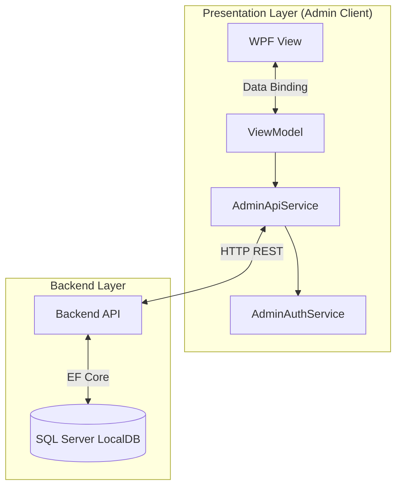
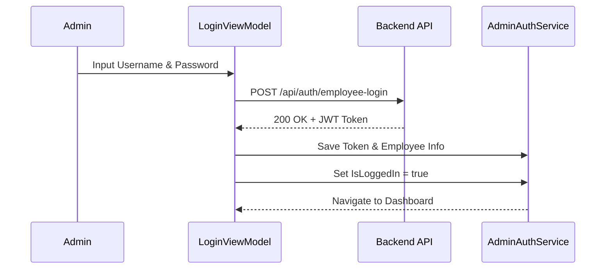

# BankingEcosystem.Admin.UI — Documentation

> **Project Type:** WPF Application (Windows Presentation Foundation)  
> **Target Framework:** .NET 10.0-windows  
> **Architecture:** MVVM (Model-View-ViewModel)  
> **Pattern:** Dependency Injection, Repository Pattern via API Service

---

## Project Structure

```
BankingEcosystem.Admin.UI/
├── App.xaml                     # Entry point, DI Container, Global Resources
├── MainWindow.xaml              # Main shell, navigation, and sidebar
├── Views/                       # UI Pages (XAML + CodeBehind)
│   ├── LoginView.xaml           # Employee Login Screen
│   ├── DashboardView.xaml       # Real-time Statistics Dashboard
│   ├── CustomerListView.xaml    # Customer Management (CRUD)
│   ├── AtmListView.xaml         # ATM Management (Refill, Toggle Status)
│   ├── TransactionListView.xaml # Transaction History (Search, Filter)
│   └── AuditLogView.xaml        # Admin/Employee Activity Logs
├── ViewModels/                  # Presentation Logic & State
│   ├── MainViewModel.xaml       # Navigation & Global State (User Login)
│   ├── LoginViewModel.cs        # Employee Authentication Logic
│   ├── DashboardViewModel.cs    # Fetch & bind dashboard stats
│   ├── CustomerListViewModel.cs # Customer list logic
│   ├── TransactionListViewModel.cs # Transaction sort/filter logic
│   └── ... (Other ViewModels)
├── Services/                    # Backend Communication Layer
│   ├── AdminApiService.cs       # HTTP Call Wrapper for Backend API
│   ├── AdminAuthService.cs      # State management (Token, Employee Info)
│   └── NavigationService.cs     # ViewModel Navigation Helper
├── Resources/                   # Global styles & themes
│   └── AdminTheme.xaml          # Colors (Corporate Blue), Styles (Button, Input)
├── doc/
│   └── README.md                # Documentation (this file)
└── ...
```

---

## Application Architecture

Review of the **MVVM** architecture in the Admin UI connected to the **Backend API**:



### 1. Presentation Layer (WPF)

- **Views**: Pure XAML for the UI. Uses `DataTemplate` in `MainWindow.xaml` to map ViewModels to Views.
- **ViewModels**: Uses `CommunityToolkit.Mvvm` (`ObservableObject`, `RelayCommand`) for reactive & clean binding.

### 2. Service Layer

- **AdminApiService**:
  - Centralizes HTTP calls (`HttpClient`).
  - Automatically handles Authorization Headers (Bearer Token).
  - Wrapper endpoints: `GetCustomersAsync`, `CreateAtmAsync`, `GetDashboardStatsAsync`, etc.
- **AdminAuthService**:
  - Stores JWT Token after login.
  - Stores logged-in employee info (`EmployeeName`, `Role`).

---

## Features & Flows

### 1. Authentication Flow

Bank employees must login using credentials (initial seed: `admin`/`admin123`).



### 2. Dashboard Monitoring

Admins can view system statistics in real-time.

- **Total Customers**: Number of registered customers.
- **Transactions Today**: Daily transaction volume.
- **Total ATMs**: Number of ATM machines in the network.
- **Total Deposits**: Total accumulated customer balance (Formatted: `Rp 10,000,000`).

### 3. Customer Management

Full customer management features:

- **Customer List**: DataGrid with search.
- **Add Customer**: New customer registration form (NIK, Name, etc.).
- **Customer Detail**: View balance, account list (`Savings`, `Checking`), and customer ATM cards.

### 4. ATM Management

Physical ATM machine management:

- **Add ATM**: Add a new ATM unit to the network.
- **Refill Cash**: Refill cash per denomination (50k/100k).
- **Toggle Status**: remotely activate/deactivate ATM (Online/Offline).

### 5. Reporting

- **Transaction History**: Monitor transaction flow with filters (Type: Withdraw/Deposit) and search (Ref No).
- **Audit Logs**: Track "who did what" (e.g., "Budi Created Customer", "Admin Refilled ATM").

---

## Setup & Configuration

### Prerequisites

1. **Backend API Running**: Ensure `BankingEcosystem.Backend` is running at `http://localhost:5046`.
2. **Database Seeded**: Ensure the database has initial data (Employee `admin`).

### Running the App

Run the following command from the solution root folder:

```bash
dotnet run --project src/BankingEcosystem.Admin.UI
```

### Troubleshooting

1. **Login Failed / Connection Refused**:
   - Ensure Backend API is running.
   - Check `App.xaml.cs` if `BaseAddress` is correct (`http://localhost:5046/`).
2. **Crash when Opening Transaction Page**:
   - Ensure `AdminTheme.xaml` loads all styles (`FlatDataGrid`, `FlatTextBox`).
   - Run `dotnet build` again if you recently modified XAML resources.

---

## Future Roadmap

- [ ] Implement Edit Customer.
- [ ] Print Report to PDF/Excel.
- [ ] Visual Charts in Dashboard.
