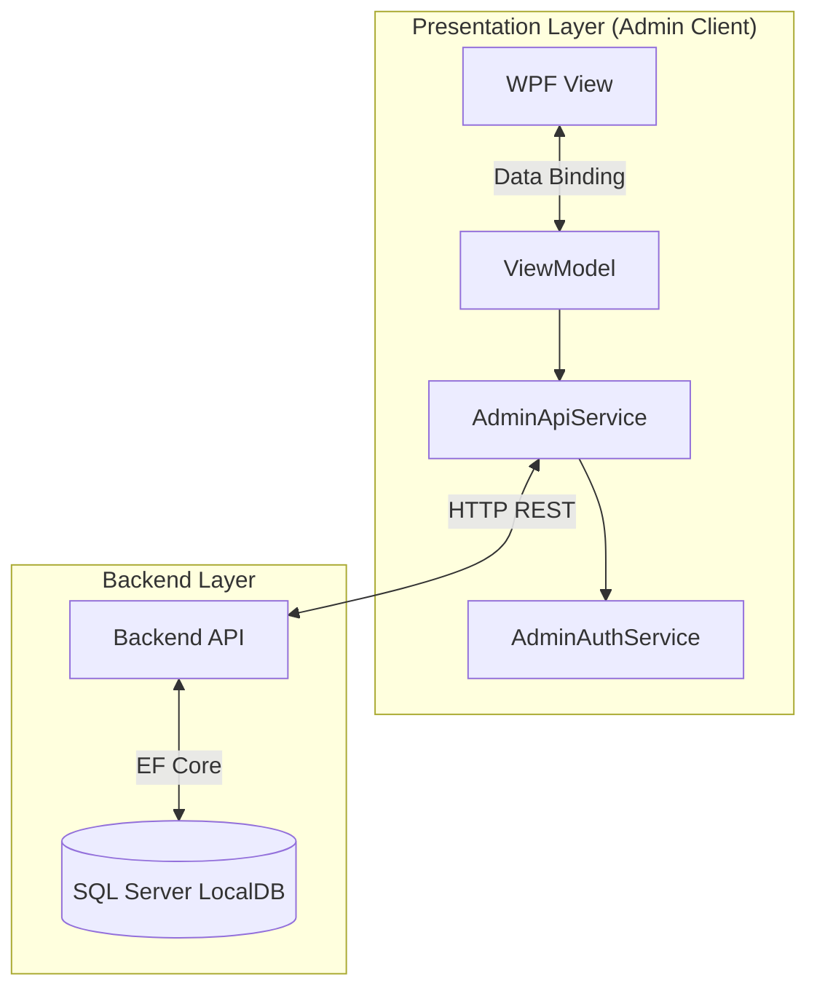
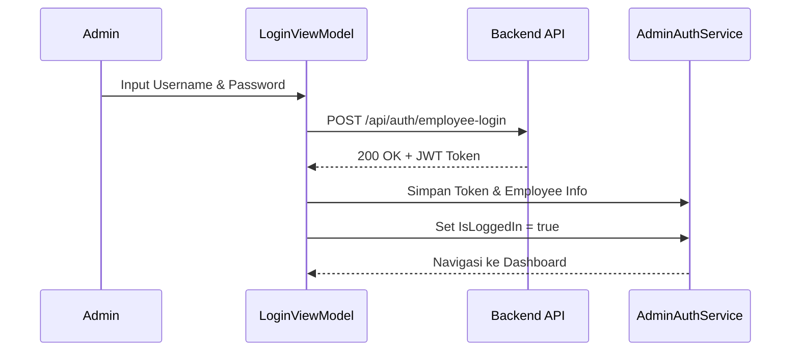

# BankingEcosystem.Admin.UI — Documentation

> **Project Type:** WPF Application (Windows Presentation Foundation)  
> **Target Framework:** .NET 10.0-windows  
> **Architecture:** MVVM (Model-View-ViewModel)  
> **Patten:** Dependency Injection, Repository Pattern via API Service

---

## Project Structure

```
BankingEcosystem.Admin.UI/
├── App.xaml                     # Entry point, DI Container, Global Resources
├── MainWindow.xaml              # Shell utama, navigasi, dan sidebar
├── Views/                       # UI Pages (XAML + CodeBehind)
│   ├── LoginView.xaml           # Login screen untuk pegawai
│   ├── DashboardView.xaml       # Dashboard statistik real-time
│   ├── CustomerListView.xaml    # Manajemen data nasabah (CRUD)
│   ├── AtmListView.xaml         # Manajemen ATM (Refill, Toggle Status)
│   ├── TransactionListView.xaml # Riwayat transaksi (Search, Filter)
│   └── AuditLogView.xaml        # Log aktivitas admin/pegawai
├── ViewModels/                  # Presentation Logic & State
│   ├── MainViewModel.xaml       # Navigasi & Global State (User Login)
│   ├── LoginViewModel.cs        # Logic autentikasi pegawai
│   ├── DashboardViewModel.cs    # Fetch & bind statistik dashboard
│   ├── CustomerListViewModel.cs # Logic list nasabah
│   ├── TransactionListViewModel.cs # Logic sort/filter transaksi
│   └── ... (ViewModels lain)
├── Services/                    # Layer komunikasi ke Backend
│   ├── AdminApiService.cs       # Wrapper HTTP Calls ke Backend API
│   ├── AdminAuthService.cs      # State management (Token, Employee Info)
│   └── NavigationService.cs     # Helper navigasi antar ViewModel
├── Resources/                   # Global styles & themes
│   └── AdminTheme.xaml          # Warna (Corporate Blue), Styles (Button, Input)
├── doc/
│   └── README.md                # Dokumentasi (file ini)
└── ...
```

---

## Application Architecture

Review arsitektur **MVVM** pada Admin UI yang terhubung ke **Backend API**:



### 1. Presentation Layer (WPF)

- **Views**: Murni XAML untuk tampilan. Menggunakan `DataTemplate` di `MainWindow.xaml` untuk mapping ViewModel ke View.
- **ViewModels**: Menggunakan `CommunityToolkit.Mvvm` (`ObservableObject`, `RelayCommand`) untuk binding yang reaktif & bersih.

### 2. Service Layer

- **AdminApiService**:
  - Sentralisasi panggilan HTTP (`HttpClient`).
  - Menangani Header Authorization (Bearer Token) otomatis.
  - Endpoint wrapper: `GetCustomersAsync`, `CreateAtmAsync`, `GetDashboardStatsAsync`, dll.
- **AdminAuthService**:
  - Menyimpan JWT Token setelah login.
  - Menyimpan info pegawai logged-in (`EmployeeName`, `Role`).

---

## Features & Flows

### 1. Authentication Flow

Pegawai bank harus login menggunakan kredensial (seeding awal: `admin`/`admin123`).



### 2. Dashboard Monitoring

Admin dapat melihat statistik sistem secara real-time.

- **Total Nasabah**: Jumlah nasabah terdaftar.
- **Transaksi Hari Ini**: Volume transaksi harian.
- **Total ATM**: Jumlah mesin ATM dalam jaringan.
- **Total Simpanan**: Akumulasi saldo nasabah (Formatted: `Rp 10.000.000`).

### 3. Customer Management

Fitur lengkap pengelolaan nasabah:

- **List Nasabah**: DataGrid dengan pencarian.
- **Add Customer**: Form pendaftaran nasabah baru (NIK, Nama, dll).
- **Detail Customer**: Melihat saldo, daftar rekening (`Savings`, `Checking`), dan kartu ATM nasabah.

### 4. ATM Management

Pengelolaan mesin ATM fisik:

- **Add ATM**: Menambah unit ATM baru ke jaringan.
- **Refill Cash**: Mengisi ulang uang tunai per denominasi (50rb/100rb).
- **Toggle Status**: Mengaktifkan/menonaktifkan ATM (Online/Offline) secara remote.

### 5. Reporting

- **Transaction History**: Memantau arus transaksi dengan filter (Type: Withdraw/Deposit) dan pencarian (Ref No).
- **Audit Logs**: Melacak "siapa melakukan apa" (e.g., "Budi Created Customer", "Admin Refilled ATM").

---

## Setup & Configuration

### Prerequisites

1. **Backend API Running**: Pastikan `BankingEcosystem.Backend` berjalan di `http://localhost:5046`.
2. **Database Seeded**: Pastikan database sudah memiliki data awal (Employee `admin`).

### Running the App

Jalankan perintah berikut dari root folder solution:

```bash
dotnet run --project src/BankingEcosystem.Admin.UI
```

### Troubleshooting

1. **Login Gagal / Connection Refused**:
   - Pastikan Backend API menyala.
   - Cek `App.xaml.cs` apakah `BaseAddress` sesuai (`http://localhost:5046/`).
2. **Crash saat Buka Halaman Transaksi**:
   - Pastikan `AdminTheme.xaml` memuat semua style (`FlatDataGrid`, `FlatTextBox`).
   - Lakukan `dotnet build` ulang jika baru saja mengubah XAML resources.

---

## Future Roadmap

- [ ] Implementasi Edit Customer.
- [ ] Print Report ke PDF/Excel.
- [ ] Grafik visual (Chart) di Dashboard.
