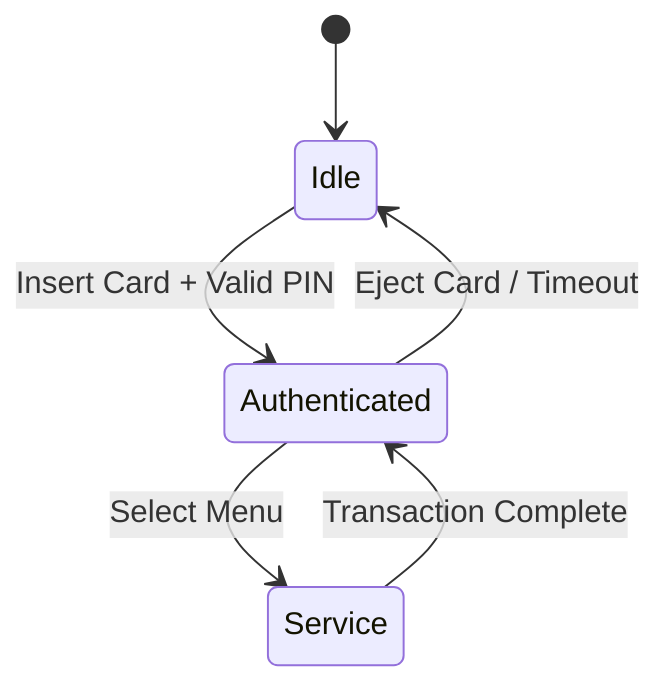

# BankingEcosystem.Atm.AppLayer — Documentation

> **Project Type:** .NET Class Library  
> **Target Framework:** .NET 10.0-windows  
> **Role:** Business Logic Layer for ATM Client  
> **Dependencies:** BankingEcosystem.Shared, BankingEcosystem.Interop

---

## Project Structure

```
BankingEcosystem.Atm.AppLayer/
├── Services/
│   ├── IAuthService.cs / AuthService.cs             # Authentication & PIN Encryption
│   ├── ITransactionService.cs / TransactionService.cs # Transaction Logic & Hardware Orchestration
│   ├── AtmSessionService.cs                         # Session Management (60s Timeout)
│   ├── IAtmStateService.cs / AtmStateService.cs     # Finite State Machine (Idle -> Auth -> Service)
│   ├── IUiService.cs                                # Interface for updating loading/busy state
│   └── IHardwareInteropService.cs / HardwareInteropService.cs # Native DLL Wrapper
├── Models/
│   └── AtmState.cs                                  # ATM State Enum
├── Helpers/
│   └── ReceiptBuilder.cs                            # ATM Receipt Formatter
└── BankingEcosystem.Atm.AppLayer.csproj
```

---

## Core Responsibilities

This layer acts as a **bridge** between the UI (WPF), Backend API, and physical Hardware. Business logic must not reside in the UI (Code-behind) but be encapsulated here.

### 1. Authentication (`AuthService`)

- **PIN Encryption:** Before sending to the API, the PIN is encrypted using XOR logic (simulating a hardware encryption module).
- **Card Validation:** Sends a request to the `/api/auth/verify-card` endpoint.
- **Session Start:** If login is successful, starts a new session in `AtmSessionService`.

### 2. Transaction Orchestration (`TransactionService`)

Complex logic for cash withdrawal:

1. **Balance Check:** Check balance via API.
2. **Limit Check:** Check daily limit via API.
3. **Hardware Check:** Check cash availability in the machine (`GetRemainingCash`).
4. **Execution:** Debit balance via API.
5. **Dispense:** Command hardware to dispense cash if API call is successful.
6. **Receipt:** Generate text receipt and print via Hardware Printer.

### 3. Session Management (`AtmSessionService`)

- Stores **JWT Token** for subsequent API requests.
- Stores `CardId`, `AccountId`, `CustomerName`.
- **Auto-Logout:** 60-second timer that resets the session if there is no activity (idle). User is forced back to the Welcome screen.

### 4. Hardware Abstraction (`HardwareInteropService`)

- Wraps P/Invoke calls to `BankingEcosystem.Hardware.dll` and `BankingEcosystem.Interop`.
- Provides a safe C# facade (Exception handling for `DllNotFoundException`).

---

## Key Interfaces

### `IAuthService`

```csharp
Task<VerifyCardResponse?> VerifyCardAsync(string cardNumber);
Task<AuthResponse?> VerifyPinAsync(int cardId, string pin);
Task<bool> ChangePinAsync(int cardId, string oldPin, string newPin);
```

### `ITransactionService`

```csharp
Task<TransactionDto?> GetBalanceAsync();
Task<string> WithdrawAsync(decimal amount);
Task<TransferResponse?> TransferAsync(string targetAccount, decimal amount, string description);
Task<List<TransactionDto>> GetHistoryAsync();
```

### `IHardwareInteropService`

```csharp
string? ReadCard();
bool EjectCard();
bool DispenseCash(int amount);
bool PrintReceipt(string data);
int GetRemainingCash();
```

---

## State Machine

The ATM application follows a strict state flow:



Managed by `AtmStateService`.
