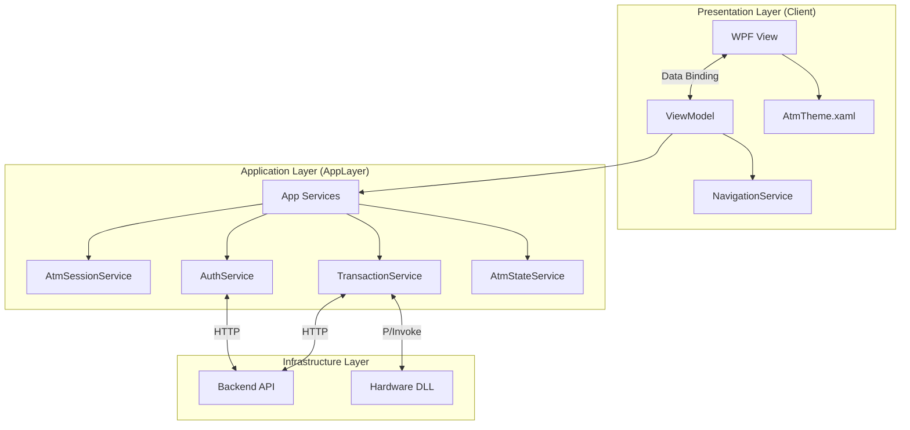

# BankingEcosystem.Atm.Client — Documentation

> **Project Type:** WPF Application (Windows Presentation Foundation)  
> **Target Framework:** .NET 10.0-windows  
> **Architecture:** MVVM (Model-View-ViewModel)  
> **Dependencies:** BankingEcosystem.Atm.AppLayer, BankingEcosystem.Hardware (Native DLL), BankingEcosystem.Shared

---

## Project Structure

```
BankingEcosystem.Atm.Client/
├── App.xaml                     # Entry point, Global Resources, DI Container
├── MainWindow.xaml              # Main Shell hosting navigation frames & Loading Overlay
├── Views/                       # UI Pages (XAML + CodeBehind)
│   ├── OnboardingView.xaml      # Login Screen (Welcome / Insert Card overlay)
│   ├── PinEntryView.xaml        # PIN Input Screen (Responsive Layout)
│   ├── MainMenuView.xaml        # Dashboard (Balance, Withdraw, Transfer)
│   ├── WithdrawView.xaml        # Cash Withdrawal (Amount Grid)
│   ├── TransferView.xaml        # Inter-account Transfer
│   ├── HistoryView.xaml         # Account Statement
│   └── ChangePinView.xaml       # Change PIN
├── ViewModels/                  # Presentation Logic (Binding sources)
│   ├── MainViewModel.cs         # Window state & Navigation
│   ├── OnboardingViewModel.cs   # Card read logic
│   ├── PinEntryViewModel.cs     # PIN masking & verification logic
│   ├── MainMenuViewModel.cs     # Dashboard stats & menu actions
│   ├── WithdrawViewModel.cs     # Withdrawal logic & validation
│   └── TransferViewModel.cs     # Transfer flow logic
├── Services/                    # UI-specific Services
│   └── NavigationService.cs     # View switching logic
├── Resources/                   # UI Assets & Styles
│   └── AtmTheme.xaml            # Styling (Colors, Button Templates, Animations, Spinner)
├── Converters/                  # WPF ValueConverters
│   └── BooleanToVisibility.cs   # Helper binding
└── bin/                         # Build output (includes native DLLs)
```

---

## Application Architecture

This system uses the **MVVM Pattern**, separating the UI (View), Logic (ViewModel), and Data/Process (Model/Service).



### 1. Presentation Layer (WPF)

- **Views:** Pure XAML with minimal code-behind for navigation/animation.
- **ViewModels:** Uses `CommunityToolkit.Mvvm` for `ObservableObject` and `RelayCommand`. Handles display logic and input validation.
- **UI Polish:**
  - **Animations:** Button hover effects (ScaleTransform), Page transitions.
  - **Loading Overlay:** Global spinner during async processes (matrix API calls).
  - **Busy State:** ViewModel controls `IsBusy` which binds to the `MainWindow` overlay.

### 2. Application Layer (`BankingEcosystem.Atm.AppLayer`)

A separate library encapsulating the ATM business logic.

- **AtmSessionService:** Stores session state (CardNumber, Token, Timeout 60s).
- **AuthService:** Card & PIN verification (with encryption).
- **TransactionService:** Orchestrates transactions (Withdraw, Transfer, History) + Hardware.
- **AtmStateService:** Manages machine state (Idle -> Authenticated -> Service).
- **HardwareInteropService:** Safe wrapper for Native DLLs.

### 3. Native Layer (C++)

Physical hardware simulation:

- `BankingEcosystem.Hardware.dll`: Card Reader (Insert/Eject), Cash Dispenser, Printer.
- `BankingEcosystem.NativeLogic.dll`: XOR Encryption for PIN, Luhn Validator.

---

## Features

### 1. Cardless / Card Simulation

- Press **'C'** on the Welcome screen to trigger the "Insert Card" simulation.
- Enter a 16-digit card number registered in the database.

### 2. Secure PIN Entry

- Virtual keyboard (randomized/fixed layout).
- PIN input is encrypted (XOR + Key) before being sent to the API.
- 3 Incorrect PIN attempts → Card automatically blocked.

### 3. Transaction Features

- **Balance Inquiry:** Real-time from backend.
- **Cash Withdrawal:**
  - Minimum balance validation (Rp 50,000 remaining).
  - Daily limit validation (Rp 10M - 50M depending on account type).
  - Cash dispense via Hardware Simulator.
- **Transfer:** Transfer to fellow bank accounts.
- **Statement:** View last 10 transactions.
- **Change PIN:** Update card PIN (requires old PIN verification).

### 4. Hardware Simulation

- **Cash Dispenser:** Decreases local cash inventory in the ATM machine.
- **Receipt Printer:** Generates `.txt` receipt files in the `bin/Debug/net10.0-windows/receipts/` folder.

---

## Setup & Configuration

### Prerequisites

1. **Backend API Running:** Ensure `BankingEcosystem.Backend` is running at `http://localhost:5046`.
2. **Database Seeded:** Run the Backend once to seed default data.
3. **Native DLLs:** C++ `.dll` files (Hardware & NativeLogic) must exist in the `bin/` output folder.

### Running the App

```bash
dotnet run --project src/BankingEcosystem.Atm.Client
```

### Hot Keys

- **C**: Insert Card (Simulation).
- **Enter**: Confirm.
- **Esc**: Cancel / Logout.

---

## Troubleshooting

### 1. "Failed to load balance" / "Network Error"

- Check if Backend API is running (`curl http://localhost:5046/health`).
- Check database connection.
- Ensure the URL configuration in `App.xaml.cs` points to the correct port (`5046`).

### 2. "Hardware DLL not found"

- Ensure C++ projects (`BankingEcosystem.Hardware` & `BankingEcosystem.NativeLogic`) are built.
- Ensure the `.dll` output files are copied to the ATM Client output folder. (Automatic via `PreBuildEvent` in `.csproj`).

### 3. Messy UI / Layout issues

- Ensure `AtmTheme.xaml` is loaded in `App.xaml`.
- Clean & Rebuild solution.
