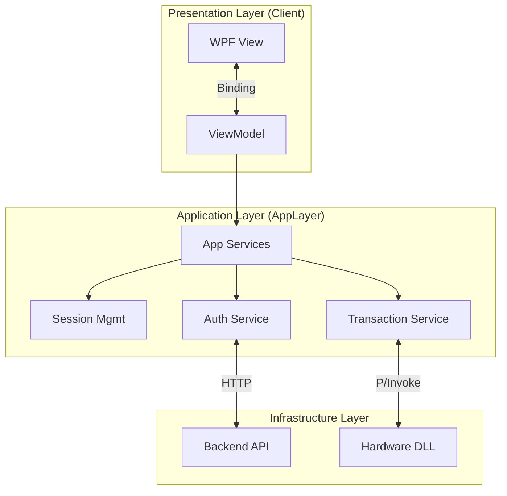
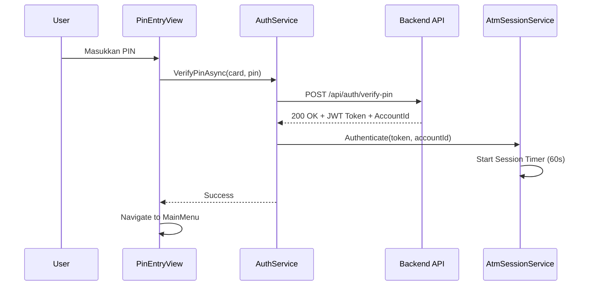
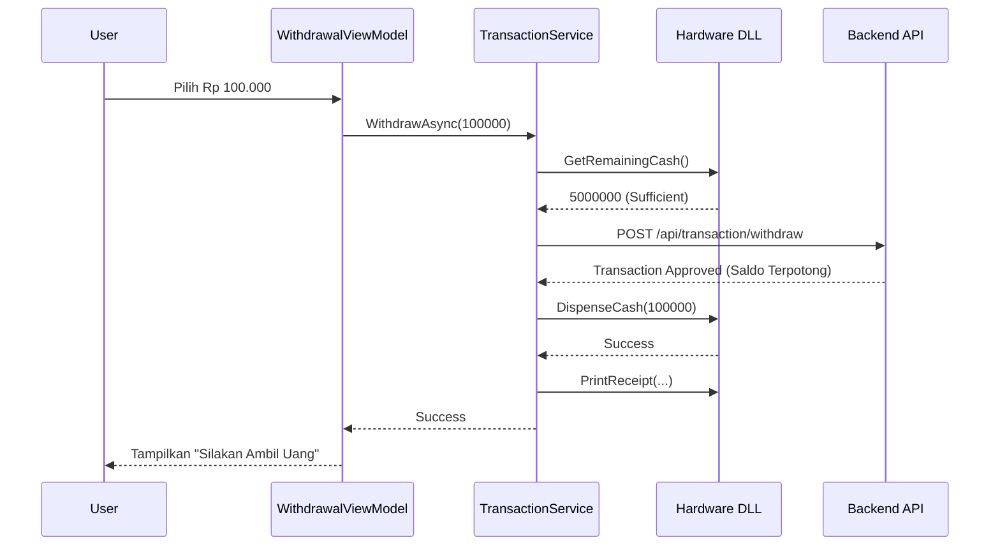

# BankingEcosystem.Atm.Client — Documentation

> **Project Type:** WPF Application (Windows Presentation Foundation)  
> **Target Framework:** .NET 10.0-windows  
> **Architecture:** MVVM (Model-View-ViewModel)  
> **Dependencies:** BankingEcosystem.Atm.AppLayer, BankingEcosystem.Hardware (Native DLL)

---

## Project Structure

```
BankingEcosystem.Atm.Client/
├── App.xaml                     # Entry point, Global Resources, DI Container
├── MainWindow.xaml              # Main Shell hosting navigation frames
├── Views/                       # UI Pages (XAML + CodeBehind)
│   ├── OnboardingView.xaml      # Idle Screen (Welcome / Insert Card)
│   ├── PinEntryView.xaml        # PIN Input Screen (Responsive Layout)
│   └── MainMenuView.xaml        # Main Dashboard (Withdraw, Balance, etc.)
├── ViewModels/                  # Presentation Logic (Binding sources)
│   └── (To be implemented in Phase 2 Step 3)
├── Services/                    # (Service Interfaces via AppLayer)
├── Resources/                   # UI Assets & Styles
│   └── AtmTheme.xaml            # Color definitions, brushes, and button styles (Navy & Gold)
├── Navigation/                  # Navigation service
├── bin/                         # Build output (includes native DLLs)
└── doc/
    └── README.md                # Dokumentasi (file ini)
```

---

## Application Architecture

System ini menggunakan **MVVM Pattern** yang memisahkan UI (View), Logic (ViewModel), dan Data/Process (Model/Service).



### 1. Presentation Layer (WPF)

- **Views:** Murni XAML + sedikit code-behind untuk navigasi/animasi.
- **ViewModels:** (Akan diimplementasikan) Menangani state UI dan command.
- **Resources:** `AtmTheme.xaml` menyimpan standard styling (Warna Navy `#0d1b2a`, Gold `#e0b1cb`) agar konsisten.

### 2. Application Layer (`BankingEcosystem.Atm.AppLayer`)

Otak dari aplikasi ATM. Tidak tergantung pada UI.

- **AtmSessionService:** Menyimpan state user saat ini (CardNumber, Token, Timeout Timer 60s).
- **AuthService:** Berkomunikasi dengan Backend API untuk memverifikasi PIN.
- **TransactionService:** Orkestra logika bisnis (Cek Saldo, Tarik Tunai) + Hardware Dispense.
- **HardwareInteropService:** Wrapper aman untuk memanggil Native DLL.

### 3. Native Layer (C++)

Simulasi hardware fisik yang diakses via P/Invoke.

- `BankingEcosystem.Hardware.dll`: Card Reader, Cash Dispenser, Printer.
- `BankingEcosystem.NativeLogic.dll`: State machine keamanan & enkripsi.

---

## Detailed Component Explanation

### `App.xaml.cs` (Dependency Injection)

Pusat konfigurasi aplikasi. Di sini kita mendaftarkan semua service ke DI Container (`Microsoft.Extensions.DependencyInjection`).

```csharp
// Register Core Services
services.AddSingleton<AtmSessionService>();
services.AddSingleton(new HttpClient { BaseAddress = new Uri("http://localhost:5000/") });

// Register App Services
services.AddSingleton<IAuthService, AuthService>();
services.AddSingleton<IHardwareInteropService, HardwareInteropService>();
services.AddSingleton<ITransactionService, TransactionService>();

// Register Views
services.AddTransient<MainWindow>();
services.AddTransient<PinEntryView>();
// ...
```

### `Views/PinEntryView.xaml` (Responsive Layout)

Screen ini memiliki logika khusus untuk menangani berbagai ukuran layar.

- **Full Screen (>1000px):** Menggunakan 2 kolom. Kiri untuk instruksi, Kanan untuk Keypad. Margin diatur agar "Lock Icon" lurus dengan dot ke-5/6 PIN.
- **Small Screen (<1000px):** Layout otomatis berubah menjadi 1 kolom tengah. **Keypad disembunyikan** agar tidak menutupi input, user diharapkan menggunakan keyboard fisik.

### `Services/TransactionService.cs`

Menangani alur transaksi yang aman:

1. **Validasi Awal:** Cek autentikasi & saldo input.
2. **Cek Hardware:** Apakah ATM punya cukup uang? (`GetRemainingCash()`)
3. **API Call:** Request debit ke Backend (`POST /api/transaction/withdraw`).
4. **Dispense:** Jika API sukses ✅, perintahkan hardware mengeluarkan uang (`DispenseCash()`).
5. **Receipt:** Cetak struk (`PrintReceipt()`).

---

## Flow Diagrams

### 1. Authentication Flow



### 2. Withdrawal Flow



---

## Setup & Configuration

### Prerequisites

1. **Backend API Running:** Pastikan `BankingEcosystem.Backend` jalan di `http://localhost:5000`.
2. **SQL Server LocalDB:** Database harus sudah ter-seed dengan data nasabah dummy.
3. **Native DLLs:** File `.dll` C++ harus ada di folder output `bin/`.

### Running the App

Jalankan perintah ini dari root folder solution:

```bash
dotnet run --project src/BankingEcosystem.Atm.Client/BankingEcosystem.Atm.Client.csproj
```

### Hot Keys (Simulation)

Karena tidak ada hardware fisik, gunakan keyboard:

- **C**: Masukkan Kartu (Insert Card) di halaman awal.
- **Enter**: Konfirmasi input / mode Cardless.
- **Esc**: Cancel / Exit session.

---

## Troubleshooting

### 1. "Card not found" / "Network Error"

- Cek apakah Backend API berjalan.
- Cek apakah database sudah di-seed.
- Pastikan URL di `App.xaml.cs` (`http://localhost:5000/`) sesuai.

### 2. UI Crash / StaticResource Not Found

- Masalah umum WPF saat resource dictionary tidak ter-load.
- Solusi: **Clean & Rebuild Solution**.
- Pastikan `App.xaml` me-merge `AtmTheme.xaml`.

### 3. Keypad Tidak Muncul

- Cek ukuran window. Keypad sengaja disembunyikan jika lebar window < 1000px (Responsive Feature).
- **Maximize window** untuk memunculkan keypad.

---

## Future Roadmap (Phase 3+)

- [ ] Implementasi ViewModels sepenuhnya (Phase 2 Step 3).
- [ ] Animasi transisi halaman.
- [ ] Integrasi suara / text-to-speech.
- [ ] Support layar sentuh (Touch event handling).
