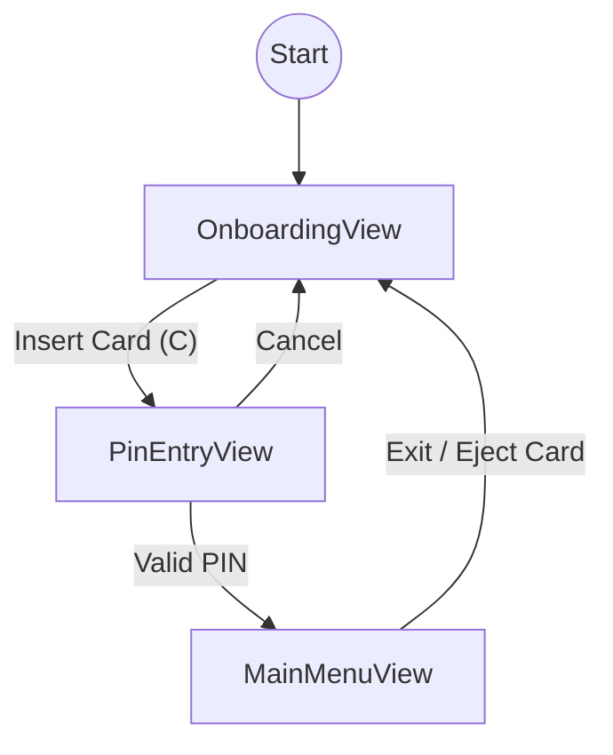

# BankingEcosystem.Atm.Client — Documentation

> **Project Type:** WPF Application (Windows Presentation Foundation)
> **Target Framework:** .NET 10.0-windows
> **Architecture:** MVVM (Model-View-ViewModel)
> **Dependencies:** BankingEcosystem.Atm.AppLayer, BankingEcosystem.Hardware (Native DLL)

---

## Project Structure

```
BankingEcosystem.Atm.Client/
├── App.xaml                     # Entry point & global resource dictionary merging
├── MainWindow.xaml              # Main Window (Shell) hosting navigation frames
├── Views/                       # UI Pages (XAML)
│   ├── OnboardingView.xaml      # Idle Screen (Welcome / Insert Card)
│   ├── PinEntryView.xaml        # PIN Input Screen (visual masking & keypad)
│   └── MainMenuView.xaml        # Main Dashboard (Withdraw, Balance, etc.)
├── ViewModels/                  # Presentation Logic (Binding sources)
│   └── (To be implemented in Phase 2)
├── Controls/                    # Custom User Controls
│   └── (To be implemented)
├── Resources/                   # UI Assets & Styles
│   └── AtmTheme.xaml            # Color definitions, brushes, and button styles (Navy & Gold)
├── Navigation/                  # Navigation service
├── bin/                         # Build output (includes native DLLs)
└── doc/
    └── README.md                # Documentation (this file)
```

---

## Implemented Features (Current)

### 1. Onboarding View (Welcome Screen)

- **Minimalist Design:** Header with Bank Logo & Digital Clock.
- **Interaction:**
  - Press **C** to simulate "Insert Card".
  - Press **Enter** for "Cardless" mode.
  - Info icon (i) with help tooltip.

### 2. PIN Entry View (Security)

- **PIN Input:** Supports physical Numpad and on-screen touch keypad.
- **Masking:** Dots (●●●●●●) display for security.
- **Validation:** "Enter" button active only when 6 digits are filled.
- **Navigation:** "Cancel" returns to welcome screen, "Clear" resets input.

### 3. Main Menu View (Dashboard)

- **Grid Menu:** 2x3 layout for main features:
  - Withdrawal
  - Deposit
  - Transfer
  - Balance Inquiry
  - Transaction History
  - Change PIN
- **Header:** Displays customer name (Placeholder) and Balance (Masked).

---

## Navigation Flow



---

## Native Dependencies (Important!)

This application relies on **Native C++ DLLs** for hardware simulation. Ensure these files exist in the output folder (`bin\Debug\net10.0-windows\`):

1. **BankingEcosystem.Hardware.dll**: Physical simulation (Card Reader, Cash Dispenser).
2. **BankingEcosystem.NativeLogic.dll**: Security logic & state machine.

_Note: These files are automatically copied during build due to `<CopyToOutputDirectory>PreserveNewest</CopyToOutputDirectory>` in `.csproj`._

---

## How to Run

Use the CLI from the root `BankingEcosystem/` folder:

```bash
# Build & Run Project
dotnet run --project src/BankingEcosystem.Atm.Client/BankingEcosystem.Atm.Client.csproj
```

### Troubleshooting

- **Startup Crash:** If the app closes immediately or throws XAML errors, clean the `bin` folder and rebuild.
- **Resource Error:** If `StaticResource not found` appears, ensure `App.xaml` loads `AtmTheme.xaml` correctly.
