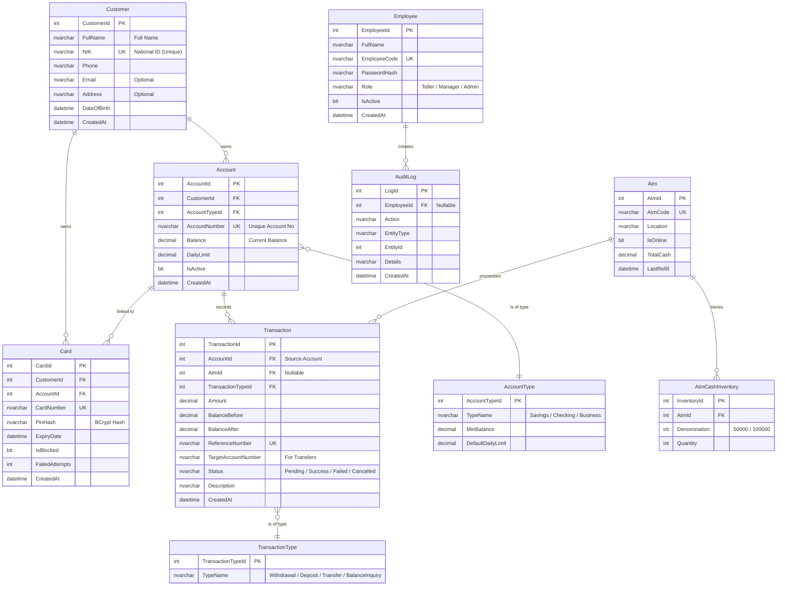

# BankingEcosystem.Backend — Documentation

> **Project Type:** ASP.NET Core Web API  
> **Target Framework:** .NET 10.0  
> **Database:** SQL Server LocalDB  
> **ORM:** Entity Framework Core

---

## Project Structure

```
BankingEcosystem.Backend/
├── Controllers/
│   ├── AuthController.cs            # Card, PIN, & Employee Authentication
│   ├── AccountController.cs         # Customer Account CRUD
│   ├── TransactionController.cs     # Withdraw, deposit, transfer, balance, history
│   ├── CardController.cs            # Card CRUD & block/unblock
│   └── AdminController.cs           # Customer, ATM, employee management + audit
├── Services/
│   ├── AuthService.cs               # Verify card/PIN, JWT, employee login
│   ├── AccountService.cs            # Account CRUD & number generation
│   ├── TransactionService.cs        # Transaction Business Logic
│   ├── CardService.cs               # Create card, hash PIN, block/unblock
│   ├── AdminService.cs              # Management services for Admin Panel
│   └── AuditLogService.cs           # Audit logging
├── DTOs/
│   └── DTOs.cs                      # All request/response records
├── Data/
│   └── BankingDbContext.cs          # EF Core DbContext (central database config)
├── Models/
│   ├── Customer.cs                  # Bank Customer
│   ├── Account.cs                   # Customer Account
│   ├── AccountType.cs               # Account Types (Savings, Checking, Business)
│   ├── Card.cs                      # ATM Card + PIN hash
│   ├── Transaction.cs               # Transaction History
│   ├── TransactionType.cs           # Transaction Types
│   ├── Atm.cs                       # ATM Machine Data
│   ├── AtmCashInventory.cs          # Cash Inventory per Denomination
│   ├── Employee.cs                  # Bank Employee (for Admin Panel)
│   └── AuditLog.cs                  # Activity Audit Log
├── Migrations/
│   ├── <timestamp>_InitialCreate.cs       # First Migration
│   ├── <timestamp>_InitialCreate.Designer.cs
│   └── BankingDbContextModelSnapshot.cs
├── Properties/
│   └── launchSettings.json          # Launch profile configuration
├── doc/
│   └── README.md                    # Documentation (this file)
├── Program.cs                       # Entry point + DI + JWT + service registration
├── appsettings.json                 # Connection string + JWT config
├── appsettings.Development.json     # Dev-specific overrides
└── BankingEcosystem.Backend.csproj  # Project file + NuGet references
```

---

## Entity Relationship Diagram (ERD)



---

## File Explanations

### `Data/BankingDbContext.cs`

Central EF Core configuration.

- Defines `DbSet<T>` for all tables.
- Uses **Fluent API** in `OnModelCreating()` for:
  - Primary keys.
  - Unique indexes (NIK, AccountNumber, CardNumber, etc.).
  - Foreign key relationships with `DeleteBehavior`.
  - Column types (`decimal(18,2)`).
  - Data seeding for `AccountType` and `TransactionType`.

### `Models/Customer.cs`

**Bank Customer** entity. Can have multiple Accounts and Cards.

- `NIK` is **unique**.

### `Models/Account.cs`

**Bank Account** entity. Linked to Customer and AccountType.

- `AccountNumber` is **unique**.
- `Balance` stores current funds.
- `DailyLimit` caps daily withdrawals.

### `Models/AccountType.cs`

Lookup table for Account Types.

- **Seeded data:**
  | ID | TypeName | MinBalance | DefaultDailyLimit |
  |---|---|---|---|
  | 1 | Savings | Rp 50,000 | Rp 10,000,000 |
  | 2 | Checking | Rp 100,000 | Rp 25,000,000 |
  | 3 | Business | Rp 500,000 | Rp 50,000,000 |

### `Models/Card.cs`

**ATM Card** entity. Linked to 1 Customer and 1 Account.

- `CardNumber` is **unique**.
- `PinHash` stores hashed PIN.
- `IsBlocked` becomes `true` if `FailedAttempts` >= 3.

### `Models/Transaction.cs`

**Transaction Record**.

- Stores `BalanceBefore` / `BalanceAfter` snapshots.
- `ReferenceNumber` is unique.
- `Status`: `Pending` → `Success` / `Failed`.

### `Models/Atm.cs`

**ATM Machine** entity.

- `AtmCode` is unique (e.g., `ATM-001`).
- `TotalCash` tracks available funds.

### `Models/AtmCashInventory.cs`

Tracks bills count per denomination for each ATM (Cascade Delete enabled).

### `Models/Employee.cs`

**Bank Employee** entity for the Admin Panel.

- `EmployeeCode` is unique.
- `Role`: `Teller`, `Manager`, `Admin`.

### `Models/AuditLog.cs`

Tracks all employee actions.

### `Program.cs`

Application Entry Point.

1. Registers `BankingDbContext`.
2. Registers Services (`AuthService`, `AccountService`, etc.) as **Scoped**.
3. Configures **JWT Bearer Authentication**.
4. Registers Controllers + OpenAPI.
5. Sets up Middleware pipeline.

### `appsettings.json`

Configuration file:

- **ConnectionStrings**: LocalDB.
- **Jwt**: Key, Issuer, Audience.

---

## API Endpoints

### `Controllers/AuthController.cs`

Authentication for Customers (ATM) and Employees.

| Method | Endpoint                   | Function                                   |
| ------ | -------------------------- | ------------------------------------------ |
| POST   | `/api/auth/verify-card`    | Verify ATM Card by Number                  |
| POST   | `/api/auth/verify-pin`     | Validate PIN (BCrypt, Auto-block >3 fails) |
| POST   | `/api/auth/employee-login` | Employee Login, returns JWT                |

**Flow:**

1. Client sends `CardNumber` → Server returns `CardId`, `AccountId`, `IsBlocked`.
2. If distinct, client sends `CardId` + `PIN`.
3. Server verifies hash → Returns JWT + Account Data.

### `Controllers/AccountController.cs`

Customer Account Management.

| Method | Endpoint                       | Function                                  |
| ------ | ------------------------------ | ----------------------------------------- |
| GET    | `/api/account/{id}`            | Get by ID                                 |
| GET    | `/api/account/by-number/{num}` | Get by Account Number                     |
| GET    | `/api/account/customer/{id}`   | Get all accounts for a customer           |
| POST   | `/api/account`                 | Create new account (Auto-generate Number) |

**Auto-generate:** `ACC{YYYYMMDD}{6 random digits}`.

### `Controllers/TransactionController.cs`

Banking Operations.

| Method | Endpoint                        | Function                                |
| ------ | ------------------------------- | --------------------------------------- |
| POST   | `/api/transaction/withdraw`     | Cash Withdrawal (Check Balance + Limit) |
| POST   | `/api/transaction/deposit`      | Cash Deposit                            |
| POST   | `/api/transaction/transfer`     | Fund Transfer                           |
| GET    | `/api/transaction/balance/{id}` | Check Balance                           |
| GET    | `/api/transaction/history/{id}` | Transaction History (Paginated)         |

**Validation:**

- Minimum remaining balance Rp 50,000.
- Daily Limit check.

### `Controllers/CardController.cs`

ATM Card Management.

| Method | Endpoint                 | Function                      |
| ------ | ------------------------ | ----------------------------- |
| POST   | `/api/card`              | Create Card + Hash PIN        |
| PATCH  | `/api/card/{id}/block`   | Block Card                    |
| PATCH  | `/api/card/{id}/unblock` | Unblock Card + Reset Attempts |

**Auto-generate:** `6221{12 random digits}`.

### `Controllers/AdminController.cs`

Admin Panel Endpoints.

| Method | Endpoint                      | Function              |
| ------ | ----------------------------- | --------------------- |
| GET    | `/api/admin/customers`        | List Customers        |
| POST   | `/api/admin/customers`        | Register Customer     |
| POST   | `/api/admin/atms`             | Add ATM               |
| POST   | `/api/admin/atms/refill`      | Refill ATM Cash       |
| PATCH  | `/api/admin/atms/{id}/toggle` | Toggle Online/Offline |
| GET    | `/api/admin/audit-logs`       | View Audit Logs       |

---

## Service Layer

- **AuthService**: Handles VerifyCard, VerifyPin, EmployeeLogin, JWT Generation.
- **AccountService**: CRUD Accounts, Generate Numbers.
- **TransactionService**: Logic for Withdraw, Deposit, Transfer, Balance Inquiry.
- **CardService**: Create Card, Block/Unblock, Hash PIN.
- **AdminService**: Customer, ATM, Employee Management.
- **AuditLogService**: High-level logging of important actions.

---

## DTOs (`DTOs/DTOs.cs`)

All Request/Response objects are C# `record` types.

- **Auth**: `VerifyCardRequest`, `VerifyPinRequest`, `AuthResponse`.
- **Account**: `AccountDto`, `CreateAccountRequest`.
- **Transaction**: `TransactionDto`, `WithdrawRequest`, `TransferRequest`.
- **Admin**: `CustomerDto`, `AtmDto`, `AuditLogDto`.

---

## Migration Flow

### EF Core Commands

```bash
# Add new migration
dotnet ef migrations add <MigrationName> --project src/BankingEcosystem.Backend

# Apply migration to database
dotnet ef database update --project src/BankingEcosystem.Backend

# Rollback last migration
dotnet ef migrations remove --project src/BankingEcosystem.Backend
```

**Applied Migrations:**
| Migration | Status |
|---|---|
| `InitialCreate` | ✅ Applied |

---

## Development Commands

```bash
# Build project
dotnet build src/BankingEcosystem.Backend

# Run API server
dotnet run --project src/BankingEcosystem.Backend

# Run with hot reload
dotnet watch run --project src/BankingEcosystem.Backend
```
