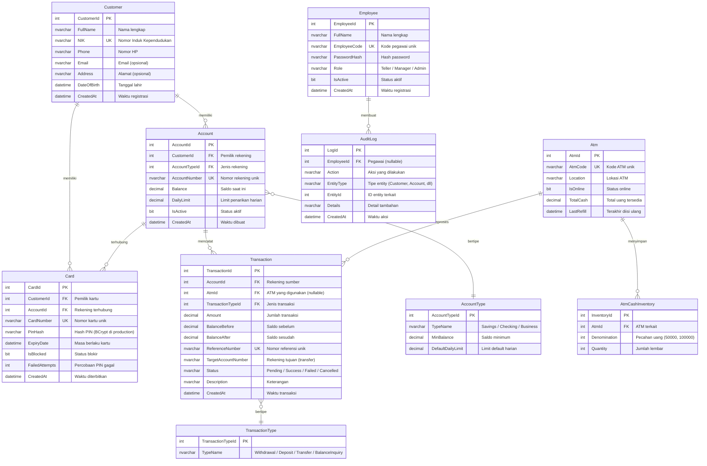
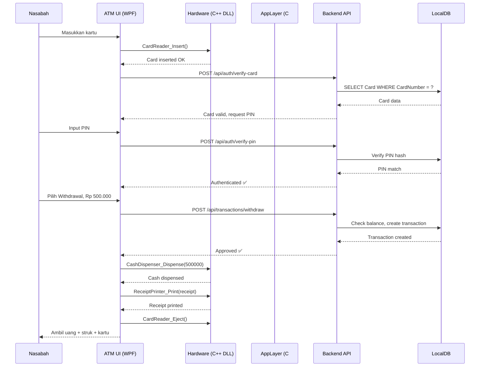
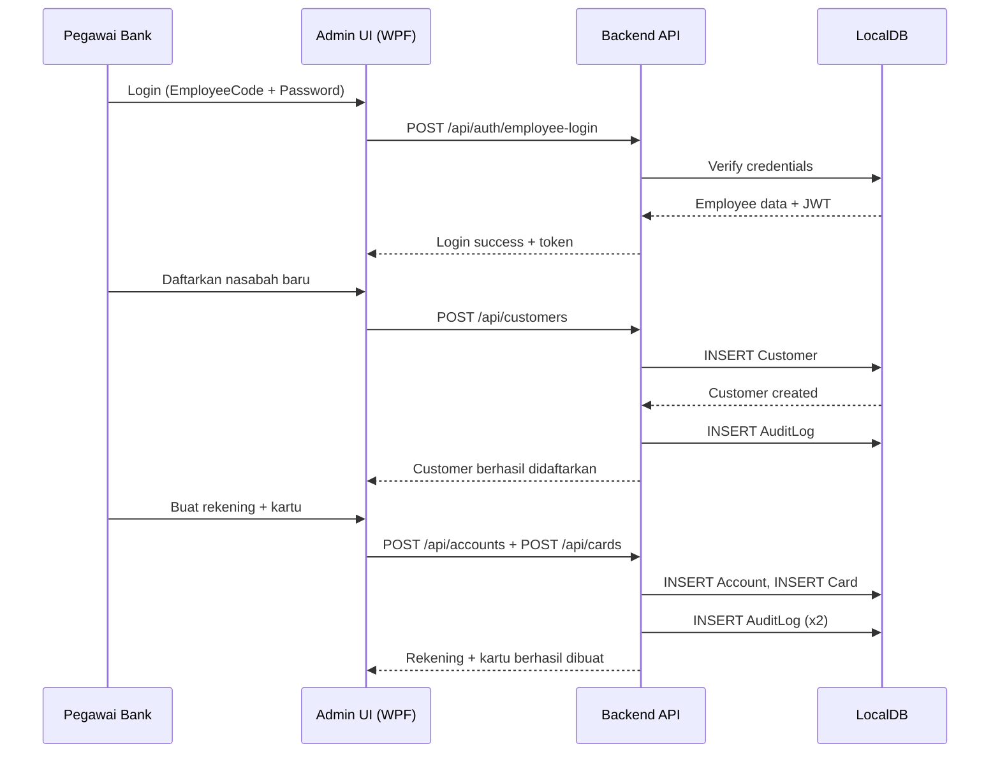
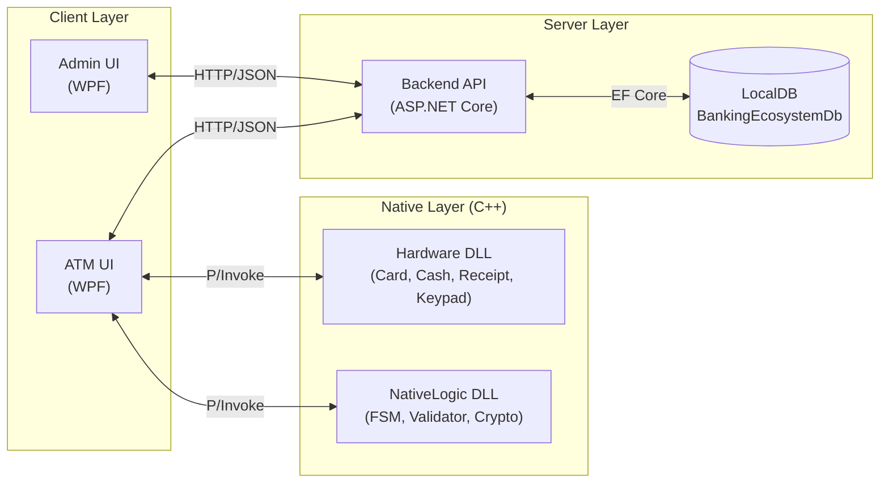

# BankingEcosystem.Backend — Documentation

> **Project Type:** ASP.NET Core Web API  
> **Target Framework:** .NET 10.0  
> **Database:** SQL Server LocalDB  
> **ORM:** Entity Framework Core

---

## Project Structure

```
BankingEcosystem.Backend/
├── Controllers/
│   ├── AuthController.cs            # Autentikasi kartu, PIN, pegawai
│   ├── AccountController.cs         # CRUD rekening nasabah
│   ├── TransactionController.cs     # Withdraw, deposit, transfer, balance, history
│   ├── CardController.cs            # CRUD kartu + block/unblock
│   └── AdminController.cs           # Customer, ATM, employee management + audit
├── Services/
│   ├── AuthService.cs               # Verify card/PIN, JWT, employee login
│   ├── AccountService.cs            # CRUD rekening, generate nomor
│   ├── TransactionService.cs        # Business logic transaksi
│   ├── CardService.cs               # Buat kartu, hash PIN, block/unblock
│   ├── AdminService.cs              # Customer, ATM, employee management
│   └── AuditLogService.cs           # Logging audit aksi
├── DTOs/
│   └── DTOs.cs                      # Semua request/response records
├── Data/
│   └── BankingDbContext.cs          # EF Core DbContext (central database config)
├── Models/
│   ├── Customer.cs                  # Data nasabah bank
│   ├── Account.cs                   # Rekening nasabah
│   ├── AccountType.cs               # Jenis rekening (Savings, Checking, Business)
│   ├── Card.cs                      # Kartu ATM + PIN hash
│   ├── Transaction.cs               # Riwayat transaksi
│   ├── TransactionType.cs           # Jenis transaksi
│   ├── Atm.cs                       # Data mesin ATM
│   ├── AtmCashInventory.cs          # Inventaris uang di ATM per denominasi
│   ├── Employee.cs                  # Pegawai bank (untuk Admin Panel)
│   └── AuditLog.cs                  # Log audit aktivitas
├── Migrations/
│   ├── <timestamp>_InitialCreate.cs       # Migration pertama
│   ├── <timestamp>_InitialCreate.Designer.cs
│   └── BankingDbContextModelSnapshot.cs
├── Properties/
│   └── launchSettings.json          # Konfigurasi launch profile
├── doc/
│   └── README.md                    # Dokumentasi (file ini)
├── Program.cs                       # Entry point + DI + JWT + service registration
├── appsettings.json                 # Connection string + JWT config
├── appsettings.Development.json     # Dev-specific overrides
└── BankingEcosystem.Backend.csproj  # Project file + NuGet references
```

---

## Entity Relationship Diagram (ERD)



---

## Penjelasan Setiap File

### `Data/BankingDbContext.cs`

Pusat konfigurasi database menggunakan EF Core. File ini:

- Mendefinisikan semua `DbSet<T>` untuk setiap tabel
- Menggunakan **Fluent API** di `OnModelCreating()` untuk:
  - Menentukan primary keys
  - Membuat unique indexes (NIK, AccountNumber, CardNumber, dll)
  - Mengatur foreign key relationships dengan `DeleteBehavior`
  - Menentukan tipe kolom decimal (`decimal(18,2)`)
  - Meng-seed data awal untuk `AccountType` dan `TransactionType`

### `Models/Customer.cs`

Entitas **Nasabah Bank**. Setiap customer bisa memiliki banyak `Account` (rekening) dan `Card` (kartu ATM).

- `NIK` bersifat **unique** — tidak bisa duplikat
- Relasi: 1 Customer → banyak Account, 1 Customer → banyak Card

### `Models/Account.cs`

Entitas **Rekening Bank**. Terhubung ke Customer dan AccountType.

- `AccountNumber` bersifat **unique** — nomor rekening unik
- `Balance` menyimpan saldo saat ini (tipe `decimal(18,2)`)
- `DailyLimit` mengatur batas penarikan harian
- `IsActive` untuk soft-delete (menonaktifkan tanpa menghapus)
- Relasi: 1 Account → banyak Transaction, 1 Account → banyak Card

### `Models/AccountType.cs`

Entitas **Jenis Rekening** — lookup table.

- **Seeded data:**
  | ID | TypeName | MinBalance | DefaultDailyLimit |
  |---|---|---|---|
  | 1 | Savings | Rp 50.000 | Rp 10.000.000 |
  | 2 | Checking | Rp 100.000 | Rp 25.000.000 |
  | 3 | Business | Rp 500.000 | Rp 50.000.000 |

### `Models/Card.cs`

Entitas **Kartu ATM**. Setiap kartu terhubung ke 1 Customer dan 1 Account.

- `CardNumber` bersifat **unique**
- `PinHash` menyimpan hash PIN (di production pakai BCrypt)
- `IsBlocked` otomatis `true` jika `FailedAttempts` >= 3
- `ExpiryDate` untuk masa berlaku kartu

### `Models/Transaction.cs`

Entitas **Transaksi**. Mencatat setiap transaksi yang terjadi.

- `BalanceBefore` / `BalanceAfter` — snapshot saldo sebelum dan sesudah
- `ReferenceNumber` — nomor referensi unik untuk setiap transaksi
- `TargetAccountNumber` — hanya diisi jika transaksi **Transfer**
- `Status` — `Pending` → `Success` / `Failed` / `Cancelled`
- `AtmId` nullable — transaksi dari Admin Panel tidak melalui ATM

### `Models/TransactionType.cs`

Entitas **Jenis Transaksi** — lookup table.

- **Seeded data:**
  | ID | TypeName |
  |---|---|
  | 1 | Withdrawal |
  | 2 | Deposit |
  | 3 | Transfer |
  | 4 | BalanceInquiry |

### `Models/Atm.cs`

Entitas **Mesin ATM**. Menyimpan data fisik setiap ATM.

- `AtmCode` bersifat **unique** (contoh: `ATM-001`)
- `TotalCash` total uang yang tersedia di mesin
- `IsOnline` status operasional mesin
- `LastRefill` waktu terakhir diisi ulang

### `Models/AtmCashInventory.cs`

Entitas **Inventaris Uang ATM**. Detail pecahan uang di setiap ATM.

- Contoh: ATM-001 memiliki 500 lembar Rp100.000 dan 300 lembar Rp50.000
- Relasi: cascade delete (hapus ATM → hapus inventaris)

### `Models/Employee.cs`

Entitas **Pegawai Bank** — untuk Admin Panel/Bank Office System.

- `EmployeeCode` bersifat **unique** (contoh: `EMP-001`)
- `PasswordHash` untuk autentikasi admin
- `Role` — `Teller`, `Manager`, `Admin`
- Pegawai mengelola nasabah, rekening, dan ATM melalui Admin Panel

### `Models/AuditLog.cs`

Entitas **Log Audit**. Mencatat semua aksi yang dilakukan pegawai.

- `Action` — contoh: `CREATE_CUSTOMER`, `BLOCK_CARD`, `REFILL_ATM`
- `EntityType` — `Customer`, `Account`, `Card`, `Atm`, dll
- `EntityId` — ID dari entity terkait
- `EmployeeId` nullable — aksi sistem tidak punya pegawai

### `Program.cs`

Entry point aplikasi. Melakukan:

1. Registrasi `BankingDbContext` ke DI container
2. Registrasi semua service (`AuthService`, `AccountService`, dll.) sebagai **Scoped**
3. Konfigurasi **JWT Bearer Authentication** dengan validasi issuer, audience, dan signing key
4. Registrasi controller + OpenAPI (development only)
5. Middleware pipeline: HTTPS → Authentication → Authorization → Controllers

### `appsettings.json`

File konfigurasi utama:

```json
{
  "ConnectionStrings": {
    "DefaultConnection": "Server=(localdb)\\MSSQLLocalDB;Database=BankingEcosystemDb;..."
  },
  "Jwt": {
    "Key": "BankingEcosystemSuperSecretKey2026!@#$%^&*()",
    "Issuer": "BankingEcosystem",
    "Audience": "BankingEcosystemClient"
  }
}
```

- **SQL Server LocalDB** — tidak perlu install SQL Server terpisah
- **JWT config** — key, issuer, audience untuk token authentication

---

## API Endpoints

### `Controllers/AuthController.cs`

Autentikasi untuk nasabah (via ATM) dan pegawai bank.

| Method | Endpoint                   | Fungsi                                            |
| ------ | -------------------------- | ------------------------------------------------- |
| POST   | `/api/auth/verify-card`    | Verifikasi kartu ATM berdasarkan nomor kartu      |
| POST   | `/api/auth/verify-pin`     | Validasi PIN (BCrypt verify, auto-block 3x gagal) |
| POST   | `/api/auth/employee-login` | Login pegawai bank, return JWT token              |

**Flow verify-card → verify-pin:**

1. Client kirim `CardNumber` → Server return `CardId`, `AccountId`, `IsBlocked`
2. Jika kartu tidak diblokir, client kirim `CardId` + `PIN`
3. Server verifikasi hash → return JWT + data akun jika valid
4. Jika salah 3x berturut-turut → kartu otomatis **diblokir**

### `Controllers/AccountController.cs`

Manajemen rekening nasabah.

| Method | Endpoint                       | Fungsi                                   |
| ------ | ------------------------------ | ---------------------------------------- |
| GET    | `/api/account/{id}`            | Get rekening berdasarkan ID              |
| GET    | `/api/account/by-number/{num}` | Get rekening berdasarkan nomor rekening  |
| GET    | `/api/account/customer/{id}`   | Get semua rekening milik nasabah         |
| POST   | `/api/account`                 | Buat rekening baru (auto-generate nomor) |

**Auto-generate:** Nomor rekening format `ACC{YYYYMMDD}{6 digit random}`

### `Controllers/TransactionController.cs`

Semua operasi transaksi perbankan.

| Method | Endpoint                        | Fungsi                                                 |
| ------ | ------------------------------- | ------------------------------------------------------ |
| POST   | `/api/transaction/withdraw`     | Tarik tunai (cek saldo minimum Rp50.000 + daily limit) |
| POST   | `/api/transaction/deposit`      | Setor tunai                                            |
| POST   | `/api/transaction/transfer`     | Transfer antar rekening (max Rp100.000.000)            |
| GET    | `/api/transaction/balance/{id}` | Cek saldo (tercatat sebagai transaksi)                 |
| GET    | `/api/transaction/history/{id}` | Riwayat transaksi (paginated, 20/page)                 |

**Validasi withdraw:**

- Saldo harus menyisakan minimal Rp 50.000
- Jumlah tidak boleh melebihi `DailyLimit`
- Setiap transaksi menyimpan `BalanceBefore` + `BalanceAfter` sebagai snapshot

### `Controllers/CardController.cs`

Manajemen kartu ATM.

| Method | Endpoint                  | Fungsi                                   |
| ------ | ------------------------- | ---------------------------------------- |
| GET    | `/api/card/{id}`          | Get kartu berdasarkan ID                 |
| GET    | `/api/card/customer/{id}` | Get semua kartu milik nasabah            |
| POST   | `/api/card`               | Buat kartu baru (hash PIN dengan BCrypt) |
| PATCH  | `/api/card/{id}/block`    | Blokir kartu                             |
| PATCH  | `/api/card/{id}/unblock`  | Buka blokir + reset failed attempts      |

**Auto-generate:** Nomor kartu format `6221{12 digit random}`

### `Controllers/AdminController.cs`

Panel admin untuk pegawai bank — mengelola nasabah, ATM, pegawai.

| Method | Endpoint                      | Fungsi                                          |
| ------ | ----------------------------- | ----------------------------------------------- |
| GET    | `/api/admin/customers`        | List semua nasabah                              |
| GET    | `/api/admin/customers/{id}`   | Get detail nasabah                              |
| POST   | `/api/admin/customers`        | Daftarkan nasabah baru + audit log              |
| PUT    | `/api/admin/customers/{id}`   | Update data nasabah + audit log                 |
| GET    | `/api/admin/atms`             | List semua ATM                                  |
| POST   | `/api/admin/atms`             | Tambah ATM baru + audit log                     |
| POST   | `/api/admin/atms/refill`      | Isi ulang uang ATM per denominasi + audit log   |
| PATCH  | `/api/admin/atms/{id}/toggle` | Toggle status online/offline ATM + audit log    |
| GET    | `/api/admin/employees`        | List semua pegawai                              |
| POST   | `/api/admin/employees`        | Tambah pegawai baru (hash password) + audit log |
| GET    | `/api/admin/audit-logs`       | Lihat audit log (paginated, 50/page)            |

---

## Service Layer

### `Services/AuthService.cs`

Menangani autentikasi:

- **VerifyCardAsync** — cari kartu by nomor, return data kartu + customer
- **VerifyPinAsync** — BCrypt.Verify PIN, auto-increment `FailedAttempts`, block jika >= 3
- **EmployeeLoginAsync** — verifikasi employee code + password
- **GenerateJwt** — buat JWT token dengan claims (name, identifier, role), 1 jam expiry

### `Services/AccountService.cs`

CRUD rekening:

- **GetByIdAsync / GetByAccountNumberAsync / GetByCustomerIdAsync** — query rekening
- **CreateAsync** — buat rekening baru dengan nomor auto-generated, set `DailyLimit` dari `AccountType`

### `Services/TransactionService.cs`

Business logic transaksi:

- **WithdrawAsync** — cek saldo (min Rp50.000 tersisa), cek daily limit, kurangi balance
- **DepositAsync** — tambah balance, catat transaksi
- **TransferAsync** — cek saldo, max Rp100 juta, kurangi source + tambah target
- **BalanceInquiryAsync** — catat inquiry sebagai transaksi (amount = 0)
- **GetHistoryAsync** — riwayat paginated, order by terbaru

### `Services/CardService.cs`

Manajemen kartu:

- **CreateAsync** — generate nomor kartu + BCrypt hash PIN, expiry 5 tahun
- **BlockCardAsync** — set `IsBlocked = true`
- **UnblockCardAsync** — set `IsBlocked = false` + reset `FailedAttempts = 0`

### `Services/AdminService.cs`

Operasi admin:

- **Customer CRUD** — create, read all/by ID, update
- **ATM Management** — create, refill (per denominasi), toggle online/offline
- **Employee Management** — create (hash password), list all

### `Services/AuditLogService.cs`

Logging audit:

- **LogAsync** — catat aksi (action, entityType, entityId, details)
- **GetLogsAsync** — query audit log paginated (50/page)

---

## DTOs (`DTOs/DTOs.cs`)

Semua Data Transfer Objects dalam satu file:

| Kategori        | Records                                                                                           |
| --------------- | ------------------------------------------------------------------------------------------------- |
| **Auth**        | `VerifyCardRequest/Response`, `VerifyPinRequest`, `AuthResponse`, `EmployeeLoginRequest/Response` |
| **Account**     | `AccountDto`, `CreateAccountRequest`                                                              |
| **Customer**    | `CustomerDto`, `CreateCustomerRequest`, `UpdateCustomerRequest`                                   |
| **Card**        | `CardDto`, `CreateCardRequest`                                                                    |
| **Transaction** | `TransactionDto`, `WithdrawRequest`, `DepositRequest`, `TransferRequest`                          |
| **ATM**         | `AtmDto`, `CreateAtmRequest`, `RefillAtmRequest`                                                  |
| **Employee**    | `EmployeeDto`, `CreateEmployeeRequest`                                                            |
| **AuditLog**    | `AuditLogDto`                                                                                     |
| **Generic**     | `ApiResponse<T>`, `PaginatedResponse<T>`                                                          |

Semua menggunakan C# `record` type (immutable, value equality)

---

## Migration Flow

### Cara Kerja EF Core Migration

```
Code (Models + DbContext)
        │
        ▼
┌─────────────────────────┐
│ dotnet ef migrations add │ ← Generate migration file dari perubahan model
│       InitialCreate      │
└────────────┬────────────┘
             │
             ▼
    Migrations/
    └── <timestamp>_InitialCreate.cs    ← SQL instructions (Up / Down)
             │
             ▼
┌─────────────────────────┐
│ dotnet ef database update│ ← Eksekusi migration ke database
└────────────┬────────────┘
             │
             ▼
    LocalDB: BankingEcosystemDb  ← Tabel sudah terbuat!
```

### Perintah Migration

```bash
# Buat migration baru (setelah mengubah model)
dotnet ef migrations add <NamaMigration> --project src/BankingEcosystem.Backend

# Terapkan migration ke database
dotnet ef database update --project src/BankingEcosystem.Backend

# Rollback migration terakhir
dotnet ef migrations remove --project src/BankingEcosystem.Backend

# Reset database (hapus dan buat ulang)
dotnet ef database drop --project src/BankingEcosystem.Backend
dotnet ef database update --project src/BankingEcosystem.Backend
```

### Migration yang Sudah Diterapkan

| Migration       | Deskripsi                          | Status     |
| --------------- | ---------------------------------- | ---------- |
| `InitialCreate` | Membuat semua 10 tabel + seed data | ✅ Applied |

---

## Application Flow

### 1. ATM Transaction Flow



### 2. Admin Panel Flow



### 3. Data Flow Overview



---

## Security Notes

| Aspek                 | Pendekatan                                        |
| --------------------- | ------------------------------------------------- |
| **PIN Hash**          | BCrypt (di production, backend handles hashing)   |
| **Employee Password** | BCrypt hash di database                           |
| **Card Block**        | Otomatis setelah 3x PIN salah                     |
| **Auth**              | JWT token untuk API authentication                |
| **Audit Trail**       | Semua aksi admin tercatat di `AuditLog`           |
| **Delete Behavior**   | `Restrict` (mencegah cascade delete data penting) |

---

## Development Commands

```bash
# Build project
dotnet build src/BankingEcosystem.Backend

# Run API server
dotnet run --project src/BankingEcosystem.Backend

# Run with hot reload
dotnet watch run --project src/BankingEcosystem.Backend

# Add new migration
dotnet ef migrations add <Name> --project src/BankingEcosystem.Backend

# Apply migrations
dotnet ef database update --project src/BankingEcosystem.Backend
```
