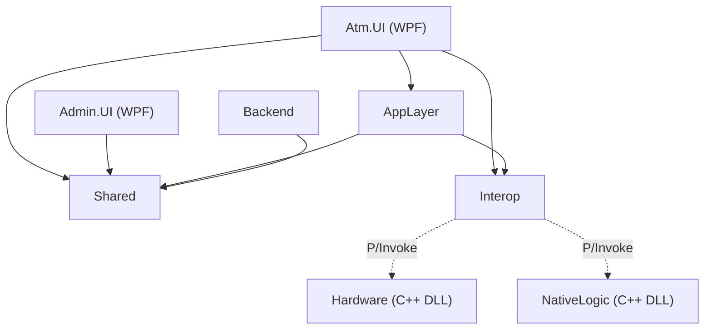

# Phase 1 — Foundation Setup [X]

## Step 1 — Solution Structure Setup [X]

## What Was Done

Created the complete [BankingEcosystem.slnx](file:///c:/project/bank_ecosystem/BankingEcosystem.slnx) solution with **8 projects**:

| Project                         | Type          | Target                    | Status |
| ------------------------------- | ------------- | ------------------------- | ------ |
| `BankingEcosystem.Atm.UI`       | WPF App       | net10.0-windows           | [X]    |
| `BankingEcosystem.Admin.UI`     | WPF App       | net10.0-windows           | [X]    |
| `BankingEcosystem.Atm.AppLayer` | Class Library | net10.0-windows           | [X]    |
| `BankingEcosystem.Interop`      | Class Library | net10.0-windows           | [X]    |
| `BankingEcosystem.Shared`       | Class Library | net10.0 + net10.0-windows | [X]    |
| `BankingEcosystem.Backend`      | Web API       | net10.0                   | [X]    |
| `BankingEcosystem.Hardware`     | C++ DLL       | x64 (.vcxproj)            | [X]    |
| `BankingEcosystem.NativeLogic`  | C++ DLL       | x64 (.vcxproj)            | [X]    |

## Dependency Graph



## C++ Source Files Created

**Hardware DLL:** [atm_hardware.h](file:///c:/project/bank_ecosystem/src/BankingEcosystem.Hardware/include/atm_hardware.h), [card_reader.cpp](file:///c:/project/bank_ecosystem/src/BankingEcosystem.Hardware/src/card_reader.cpp), [cash_dispenser.cpp](file:///c:/project/bank_ecosystem/src/BankingEcosystem.Hardware/src/cash_dispenser.cpp), [receipt_printer.cpp](file:///c:/project/bank_ecosystem/src/BankingEcosystem.Hardware/src/receipt_printer.cpp), [keypad.cpp](file:///c:/project/bank_ecosystem/src/BankingEcosystem.Hardware/src/keypad.cpp)
**NativeLogic DLL:** `atm_state_machine.h/cpp`, `transaction_validator.h/cpp`, `encryption_helper.h/cpp`

## Shared Library

- [Enums.cs](file:///c:/project/bank_ecosystem/src/BankingEcosystem.Shared/Enums/Enums.cs) — TransactionType, AccountType, AtmState, TransactionStatus
- [BankingConstants.cs](file:///c:/project/bank_ecosystem/src/BankingEcosystem.Shared/Constants/BankingConstants.cs) — PIN length, limits, denominations

## Build Verification

```
Build succeeded.
    0 Warning(s)
    0 Error(s)
```

---

## Step 2 — Database Schema + EF Core [X]

### Entity Models (10 tables)

| Entity                                                                                                             | Key Columns                                                        |
| ------------------------------------------------------------------------------------------------------------------ | ------------------------------------------------------------------ |
| [Customer](file:///c:/project/bank_ecosystem/src/BankingEcosystem.Backend/Models/Customer.cs#3-18)                 | FullName, NIK (unique), Phone, Email                               |
| [Account](file:///c:/project/bank_ecosystem/src/BankingEcosystem.Backend/Models/Account.cs#3-20)                   | AccountNumber (unique), Balance, DailyLimit                        |
| [AccountType](file:///c:/project/bank_ecosystem/src/BankingEcosystem.Backend/Models/AccountType.cs#3-13)           | TypeName — **seeded** (Savings/Checking/Business)                  |
| [Card](file:///c:/project/bank_ecosystem/src/BankingEcosystem.Backend/Models/Card.cs#3-19)                         | CardNumber (unique), PinHash, IsBlocked, FailedAttempts            |
| [Transaction](file:///c:/project/bank_ecosystem/src/BankingEcosystem.Backend/Models/Transaction.cs#3-23)           | Amount, BalanceBefore/After, ReferenceNumber (unique)              |
| [TransactionType](file:///c:/project/bank_ecosystem/src/BankingEcosystem.Backend/Models/TransactionType.cs#3-11)   | TypeName — **seeded** (Withdrawal/Deposit/Transfer/BalanceInquiry) |
| [Atm](file:///c:/project/bank_ecosystem/src/BankingEcosystem.Backend/Models/Atm.cs#3-16)                           | AtmCode (unique), Location, TotalCash, IsOnline                    |
| [AtmCashInventory](file:///c:/project/bank_ecosystem/src/BankingEcosystem.Backend/Models/AtmCashInventory.cs#3-13) | Denomination, Quantity                                             |
| [Employee](file:///c:/project/bank_ecosystem/src/BankingEcosystem.Backend/Models/Employee.cs#3-16)                 | EmployeeCode (unique), PasswordHash, Role                          |
| [AuditLog](file:///c:/project/bank_ecosystem/src/BankingEcosystem.Backend/Models/AuditLog.cs#3-16)                 | Action, EntityType, Details                                        |

### Database

- **Engine:** SQL Server LocalDB
- **Database:** `BankingEcosystemDb`
- **Migration:** `InitialCreate` applied [X]
- **Connection:** [(localdb)\MSSQLLocalDB](file:///c:/project/bank_ecosystem/src/BankingEcosystem.Backend/Models/Atm.cs#3-16)

---

## Step 3 Backend API (.NET Web API) [X]

### API Endpoints

| Controller      | Method | Endpoint                        | Description                        |
| --------------- | ------ | ------------------------------- | ---------------------------------- |
| **Auth**        | POST   | `/api/auth/verify-card`         | Verifikasi kartu ATM               |
|                 | POST   | `/api/auth/verify-pin`          | Validasi PIN (auto-block 3x gagal) |
|                 | POST   | `/api/auth/employee-login`      | Login pegawai bank                 |
| **Account**     | GET    | `/api/account/{id}`             | Get rekening by ID                 |
|                 | GET    | `/api/account/by-number/{num}`  | Get rekening by nomor              |
|                 | GET    | `/api/account/customer/{id}`    | Get semua rekening nasabah         |
|                 | POST   | `/api/account`                  | Buat rekening baru                 |
| **Transaction** | POST   | `/api/transaction/withdraw`     | Tarik tunai (cek saldo + limit)    |
|                 | POST   | `/api/transaction/deposit`      | Setor tunai                        |
|                 | POST   | `/api/transaction/transfer`     | Transfer antar rekening            |
|                 | GET    | `/api/transaction/balance/{id}` | Cek saldo                          |
|                 | GET    | `/api/transaction/history/{id}` | Riwayat transaksi (paginated)      |
| **Card**        | GET    | `/api/card/{id}`                | Get kartu by ID                    |
|                 | GET    | `/api/card/customer/{id}`       | Get semua kartu nasabah            |
|                 | POST   | `/api/card`                     | Buat kartu baru + hash PIN         |
|                 | PATCH  | `/api/card/{id}/block`          | Blokir kartu                       |
|                 | PATCH  | `/api/card/{id}/unblock`        | Buka blokir kartu                  |
| **Admin**       | GET    | `/api/admin/customers`          | List semua nasabah                 |
|                 | POST   | `/api/admin/customers`          | Daftarkan nasabah baru             |
|                 | PUT    | `/api/admin/customers/{id}`     | Update data nasabah                |
|                 | GET    | `/api/admin/atms`               | List semua ATM                     |
|                 | POST   | `/api/admin/atms`               | Tambah ATM baru                    |
|                 | POST   | `/api/admin/atms/refill`        | Isi ulang uang ATM                 |
|                 | PATCH  | `/api/admin/atms/{id}/toggle`   | Toggle status ATM                  |
|                 | GET    | `/api/admin/employees`          | List semua pegawai                 |
|                 | POST   | `/api/admin/employees`          | Tambah pegawai baru                |
|                 | GET    | `/api/admin/audit-logs`         | Lihat audit log                    |

### Service Layer

| Service              | Fungsi Utama                                                   |
| -------------------- | -------------------------------------------------------------- |
| `AuthService`        | Verify card, PIN (BCrypt), employee login, JWT generation      |
| `AccountService`     | CRUD rekening, auto-generate nomor rekening                    |
| `TransactionService` | Withdraw (cek limit+saldo), deposit, transfer, balance inquiry |
| `CardService`        | Buat kartu (BCrypt PIN hash), block/unblock                    |
| `AdminService`       | CRUD customer, ATM management, employee management             |
| `AuditLogService`    | Logging audit semua aksi admin                                 |

### Security

- **JWT Authentication** (1 jam expiry)
- **BCrypt** untuk hash PIN dan password
- **Auto-block** kartu setelah 3x PIN salah
- **Audit logging** otomatis di setiap aksi admin

### Build Status

```
Build succeeded.
    0 Warning(s)
    0 Error(s)
```

---

## Step 4 C++ Hardware Simulation + Communication Layer

### Hardware DLL (BankingEcosystem.Hardware)

Simulasi hardware ATM, dikompilasi sebagai native DLL x64.

| Module         | File                | Fungsi                                                                   |
| -------------- | ------------------- | ------------------------------------------------------------------------ |
| CardReader     | card_reader.cpp     | Insert/eject kartu, state tracking                                       |
| CashDispenser  | cash_dispenser.cpp  | Dispense uang (validasi denominasi Rp50.000), tracking sisa uang, refill |
| ReceiptPrinter | receipt_printer.cpp | Simulasi cetak struk ke stdout                                           |
| Keypad         | keypad.cpp          | Simulasi input PIN, ready state                                          |

### NativeLogic DLL (BankingEcosystem.NativeLogic)

Core logic ATM di native layer.

| Module               | File                      | Fungsi                                                                                                              |
| -------------------- | ------------------------- | ------------------------------------------------------------------------------------------------------------------- |
| ATM FSM              | atm_state_machine.cpp     | Finite State Machine: Idle - CardInserted - PinEntry - Authenticated - Transaction - Dispensing - Completed - Error |
| TransactionValidator | transaction_validator.cpp | Cek withdrawal limit, sufficient balance, transfer amount max                                                       |
| EncryptionHelper     | encryption_helper.cpp     | Simple hash PIN (simulasi, production pakai BCrypt di backend)                                                      |

### C# Interop (P/Invoke)

`NativeMethods.cs` berisi `HardwareInterop` dan `NativeLogicInterop` classes dengan semua DllImport declarations.

### Build Status

Both DLLs built successfully via MSBuild (x64 Debug).

---

## Phase 2 Step 1: WPF ATM UI

### Theme & Styling

- **Palette**: Mandiri Navy (`#003D7A`) & Gold (`#F5A623`)
- **Window**: Portrait 768x1024 (Fixed size)
- **Resources**: `AtmTheme.xaml` containing styles for buttons, keypad, and typography.

### Screens Implemented

1. **OnboardingView (Welcome Screen)**
   - **Style**: Ultra Minimalist (Header Only: Logo + Jam), body kosong bersih.
   - **Info Icon**: Ikon (i) kecil di pojok kiri bawah.
     - **Hover**: Muncul tooltip "Press C to insert card or Enter for cardless".
   - **Shortcuts**: C (Card), Enter (Cardless).

2. **PinEntryView (Security)**
   - **Input**: Mendukung keyboard fisik (0-9) dan on-screen keypad.
   - **Masking**: 6-digit dot display.
   - **Validation**: Visual feedback saat input.

3. **MainMenuView (Dashboard)**
   - **Layout**: Grid 2x3 untuk menu transaksi utama.
   - **Menu Items**: Tarik Tunai, Setor Tunai, Transfer, Cek Saldo, Riwayat, Ubah PIN.
   - **Header**: Menampilkan nama nasabah & saldo (placeholder/masked).
   - **Footer**: Tombol Exit (Esc) kembali ke welcome screen.

### Build Status

Project `BankingEcosystem.Atm.UI` built successfully (net10.0-windows).

### Important Configuration

1. **Copy Native DLLs**: Added `<CopyToOutputDirectory>PreserveNewest</CopyToOutputDirectory>` for:
   - `BankingEcosystem.Hardware.dll`
   - `BankingEcosystem.NativeLogic.dll`
2. **Platform Target**: Removed explicit `x64` target to allow `Any CPU` (default). This ensures compatibility with the .NET host (`dotnet.exe`) while still running as a 64-bit process on x64 Windows.

### Running the Application

Due to build configuration issues with the initial `Atm.UI` project, the working application is now located in `src/BankingEcosystem.Atm.Client`.

1.  **Run the Client:**

    ```bash
    dotnet run --project src/BankingEcosystem.Atm.Client/BankingEcosystem.Atm.Client.csproj
    ```

    _Note: The project was rebuilt as `Atm.Client` to resolve a silent startup failure caused by corrupted build metadata. The original `Atm.UI` folder should be ignored._

### Troubleshooting Notes

- If you encounter a `XamlParseException` regarding `MandiriNavyBrush`, ensure you are using the latest code where references were corrected to `NavyBrush`.
- If the application hangs silently, ensure no lingering `Atm.Client.exe` processes are running (`taskkill /F /IM BankingEcosystem.Atm.Client.exe`).
